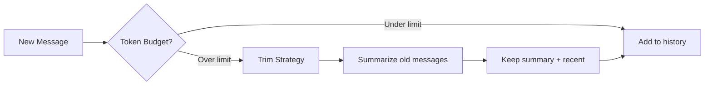

# Short-Term Memory

Short-term memory keeps track of the **current conversation**. It's what lets your agent remember "My name is Alice" three messages ago, and what prevents context windows from overflowing in long conversations.

## The Problem

LLMs have limited context windows. As conversations grow:

```text
Turn 1:  User: "My name is Alice"          ← 10 tokens
Turn 50: User: "What's my name again?"     ← 50,000 tokens total
         Agent: "I don't know" ← context overflow, lost earlier messages
```

Naive solutions have tradeoffs:

| Approach | Problem |
|----------|---------|
| **Keep everything** | Exceeds context window, costs explode |
| **Drop old messages** | Loses important context ("My name is Alice") |
| **Fixed sliding window** | Arbitrary cutoff, may drop critical info |

## SpoonOS Solution

`ShortTermMemoryManager` intelligently manages context:



| Feature | What It Does |
|---------|--------------|
| **Token-aware** | Tracks actual token count, not message count |
| **Smart trimming** | Multiple strategies: oldest first, from start, from end |
| **Summarization** | Condenses old messages into a summary when needed |
| **Built-in** | `ChatBot` handles this automatically—no extra code |

## When To Use

- **Chatbots** with multi-turn conversations
- **Agents** that need to remember earlier context
- **Long sessions** that would exceed context limits
- **Cost optimization** to reduce token usage

---

## Quick Start

```bash
pip install spoon-ai
export OPENAI_API_KEY="your-key"
```

```python
import asyncio
from spoon_ai.chat import ChatBot

# ChatBot includes built-in short-term memory with auto-trimming
llm = ChatBot(model_name="gpt-4.1", llm_provider="openai")

async def main():
    await llm.chat("My name is Alice")
    await llm.chat("What's the capital of France?")
    response = await llm.chat("What's my name?")  # Remembers "Alice"
    print(response)

asyncio.run(main())
```

---

## ShortTermMemoryManager

For fine-grained control beyond `ChatBot`'s automatic handling, use `ShortTermMemoryManager` directly:

```python
import asyncio
from spoon_ai.memory.short_term_manager import ShortTermMemoryManager, TrimStrategy
from spoon_ai.schema import Message

manager = ShortTermMemoryManager()
history = [
    Message(id="u1", role="user", content="Hello!"),
    Message(id="a1", role="assistant", content="Hi there — how can I help?"),
    Message(id="u2", role="user", content="What's DeFi?"),
]


#  Trim the message list by token budget
trimmed = asyncio.run(
    manager.trim_messages(
        messages=history,
        max_tokens=48,
        strategy=TrimStrategy.FROM_END,
        keep_system=True,
    )
)

#  Summarize history before model call
llm_ready, removals, summary = asyncio.run(
    manager.summarize_messages(
        messages=history,
        max_tokens_before_summary=48,
        messages_to_keep=2,
        summary_model="anthropic/claude-3.5-sonnet",
        llm_manager=chatbot.llm_manager,
        llm_provider=chatbot.llm_provider,
        existing_summary=chatbot.latest_summary() or "",
    )
)
```

 `llm_ready` — condensed history you can pass to the LLM
 `removals` — list of RemoveMessage directives:apply removals to your persisted history using spoon_ai.graph.reducers.add_messages.

Note: both `summarize_messages()` and `ChatBot.ask()` invoke your configured LLM. Ensure `chatbot.llm_manager`/`chatbot.llm_provider` (and any required API keys or env vars) are set so these examples can run end‑to‑end.

```python
from spoon_ai.chat import ChatBot
from spoon_ai.graph.reducers import add_messages

chatbot = ChatBot(enable_short_term_memory=True)
history = [
    Message(id="u1", role="user", content="Hello!"),
    Message(id="a1", role="assistant", content="Hi there — how can I help?"),
    Message(id="u2", role="user", content="What's DeFi?"),
]
# Remove the latest assistant message
assistant_ids = [msg.id for msg in history if msg.role == "assistant"]
remove_last = chatbot.remove_message(assistant_ids[-1])

# Or clear the entire history
remove_all = chatbot.remove_all_messages()

# Apply directives to persisted history
updated_history = add_messages(history, [remove_last])
cleared_history = add_messages(history, [remove_all])
```

`add_messages()` merges the removal directives into the existing history,
deleting targeted entries (or the entire transcript).
This mirrors how the short-term memory manager emits `RemoveMessage` items
when summarization trims older turns.

---

## Inspecting Thread State and Checkpoints

every time the graph runs, you can retrieve the latest snapshot (messages plus metadata), iterate the full checkpoint history, or read a `CheckpointTuple` for an external consumer. This makes it easy to debug memory behaviour, replay from any checkpoint, or sync state to persistent storage. The example below shows how to fetch the most recent summary, list all checkpoints, and view the tuple-style payload.

```python
config = {"configurable": {"thread_id": "memory_demo_thread"}}

snapshot = graph.get_state(config)
print("Latest checkpoint:", snapshot.metadata.get("checkpoint_id"))

for snap in graph.get_state_history(config):
    print("History id:", snap.metadata.get("checkpoint_id"))

checkpoint_tuple = graph.checkpointer.get_checkpoint_tuple(config)
print("Checkpoint tuple:", checkpoint_tuple)

for entry in graph.checkpointer.iter_checkpoint_history(config):
    print("Tuple history entry:", entry)
```

If you are using a compiled graph (`CompiledGraph`), call `graph.graph.get_state(config)` and `graph.graph.get_state_history(config)` instead; the snippet above assumes `graph` is a `StateGraph`.
