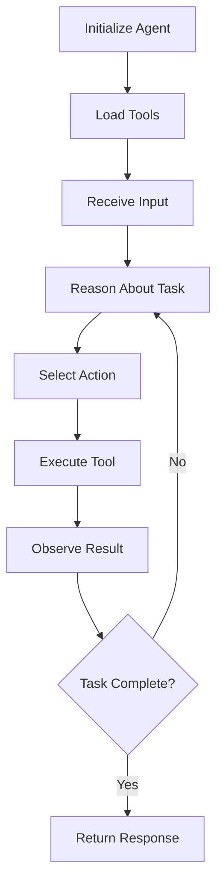

# Agents

Agents are the core intelligence layer of SpoonOS, providing reasoning, planning, and action execution capabilities.

## What are Agents?

An agent is an AI system that can:

- **Reason** about problems and goals
- **Plan** sequences of actions to achieve objectives
- **Execute** actions using available tools
- **Learn** from feedback and adapt behavior

## Agent Types

### ReAct Agents

ReAct (Reasoning + Acting) agents follow a thought-action-observation loop:

```python
from spoon_ai.agents import SpoonReactAI
from spoon_ai.chat import ChatBot

# Create a ReAct agent
agent = SpoonReactAI(
    llm=ChatBot(model_name="gpt-4.1", llm_provider="openai")
)

# Run the agent
response = await agent.run("Get the current Bitcoin price")
```

**Advantages:**

- Simple and intuitive reasoning process
- Good for straightforward tasks
- Lower computational overhead

**Best for:**

- Single-step tasks
- Direct API calls
- Simple automation

### Graph Agents

Graph agents use structured workflows with nodes and edges:

```python
from spoon_ai.agents import GraphAgent
from spoon_ai.graph import create_graph

# Create a graph workflow
graph = create_graph()
agent = GraphAgent(graph=graph)

# Execute complex workflow
result = await agent.execute("Analyze market trends and execute trades")
```

**Advantages:**

- Complex multi-step workflows
- Parallel execution capabilities
- Better error handling and recovery

**Best for:**

- Multi-step processes
- Conditional logic
- Parallel operations

## Agent Architecture

### Core Components

1. **LLM Provider** - The language model powering the agent
2. **Tool Manager** - Manages available tools and execution
3. **Memory System** - Stores conversation history and context
4. **Prompt System** - Handles system prompts and instructions

### Agent Lifecycle



## Creating Custom Agents

### Basic Agent Setup

```python
from spoon_ai.agents.base import BaseAgent
from spoon_ai.tools import ToolManager

class CustomAgent(BaseAgent):
    def __init__(self, llm, tools=None):
        super().__init__(llm)
        self.tool_manager = ToolManager(tools or [])

    async def run(self, message: str) -> str:
        # Custom agent logic here
        return await self.process_message(message)
```

### Agent Configuration

```python
# Configure agent with specific tools
from spoon_ai.tools.crypto_tools import CryptoTools
from spoon_ai.tools.web3_tools import Web3Tools

agent = SpoonReactAI(
    llm=ChatBot(model_name="gpt-4.1", llm_provider="openai"),
    tools=[CryptoTools(), Web3Tools()]
)
```

## Best Practices

### Tool Selection
- Choose tools that match your use case
- Avoid tool overload - too many tools can confuse the agent
- Test tool combinations thoroughly

### Prompt Engineering
- Provide clear, specific instructions
- Include examples of desired behavior
- Set appropriate constraints and guidelines

### Error Handling

- Leverage framework's automatic retry mechanisms
- Use built-in fallback strategies
- Rely on framework's structured error handling

### Framework Error Handling

SpoonOS agents benefit from built-in error resilience:

```python
# Framework handles errors automatically
agent = SpoonReactAI(
    llm=ChatBot(model_name="gpt-4.1", llm_provider="openai"),
    tools=[CryptoTools(), Web3Tools()]
)

# Automatic handling includes:
# - LLM provider failures with fallback
# - Tool execution errors with retry
# - Network issues with graceful degradation
response = await agent.run("Get Bitcoin price and analyze trends")
```

## Performance Considerations

### Memory Usage
- ReAct agents: Lower memory footprint
- Graph agents: Higher memory for complex workflows

### Execution Speed
- Simple tasks: ReAct agents are faster
- Complex workflows: Graph agents are more efficient

### Scalability
- ReAct: Better for high-frequency, simple tasks
- Graph: Better for complex, long-running processes

## Next Steps

### 📚 **Agent Implementation Examples**

#### 🎯 [Intent Graph Demo](../examples/intent-graph-demo.md)
**GitHub**: [View Source](https://github.com/XSpoonAi/spoon-core/blob/main/examples/intent_graph_demo.py)

**What it demonstrates:**
- Complete Graph agent implementation with intelligent routing
- Long-lived agent architecture with persistent memory
- Advanced state management and context preservation
- Production-ready error handling and recovery

**Key features:**
- Dynamic query routing based on user intent (general_qa → short_term_trend → macro_trend → deep_research)
- True parallel execution across multiple data sources
- Memory persistence and conversation context
- Real-time performance monitoring and metrics

**Best for learning:**
- Graph agent architecture patterns
- Long-running process management
- Advanced memory and state handling
- Production deployment considerations

#### 🔍 [MCP Spoon Search Agent](../examples/mcp-spoon-search-agent.md)
**GitHub**: [View Source](https://github.com/XSpoonAi/spoon-core/blob/main/examples/mcp/spoon_search_agent.py)

**What it demonstrates:**
- MCP-enabled agent with dynamic tool discovery
- Web search integration with cryptocurrency analysis
- Multi-tool orchestration and data synthesis
- Real-world agent deployment patterns

**Key features:**
- Tavily MCP server integration for web search
- Crypto PowerData tools for market analysis
- Unified analysis combining multiple data sources
- Dynamic tool loading and validation

**Best for learning:**
- MCP protocol implementation
- Multi-tool agent architecture
- Real-time data integration patterns
- Error handling in distributed systems

#### 📊 [Graph Crypto Analysis](../examples/graph-crypto-analysis.md)
**GitHub**: [View Source](https://github.com/XSpoonAi/spoon-core/blob/main/examples/graph_crypto_analysis.py)

**What it demonstrates:**
- Specialized cryptocurrency analysis agent
- LLM-driven decision making throughout the workflow
- Real-time market data processing and analysis
- Investment recommendation generation

**Key features:**
- Real Binance API integration (no simulated data)
- Technical indicator calculation (RSI, MACD, EMA, Bollinger Bands)
- Multi-timeframe analysis and correlation
- Risk assessment and market sentiment analysis

**Best for learning:**
- Domain-specific agent development
- Financial data processing patterns
- LLM-driven workflow automation
- Real API integration in agents

### 🛠️ **Development Guides**

- **[Tools System](./tools.md)** - Complete guide to available tools and integrations
- **[LLM Providers](./llm-providers.md)** - Configure and optimize language models
- **[Build Your First Agent](../how-to-guides/build-first-agent.md)** - Step-by-step agent development tutorial

### 📖 **Advanced Topics**

- **[Graph System](../core-concepts/graph-system.md)** - Advanced workflow orchestration
- **[MCP Protocol](../core-concepts/mcp-protocol.md)** - Dynamic tool discovery and execution
- **[API Reference](../api-reference/agents/base-agent.md)** - Complete agent API documentation
**GitHub**: [View Source](https://github.com/XSpoonAi/spoon-core/blob/main/examples/intent_graph_demo.py)

**What it demonstrates:**
- Complete Graph agent implementation with intelligent routing
- Long-lived agent architecture with persistent memory
- Advanced state management and context preservation
- Production-ready error handling and recovery

**Key features:**
- Dynamic query routing based on user intent (general_qa → short_term_trend → macro_trend → deep_research)
- True parallel execution across multiple data sources
- Memory persistence and conversation context
- Real-time performance monitoring and metrics

**Best for learning:**
- Graph agent architecture patterns
- Long-running process management
- Advanced memory and state handling
- Production deployment considerations

#### 🔍 [MCP Spoon Search Agent](../examples/mcp-spoon-search-agent.md)
**GitHub**: [View Source](https://github.com/XSpoonAi/spoon-core/blob/main/examples/mcp/spoon_search_agent.py)

**What it demonstrates:**
- MCP-enabled agent with dynamic tool discovery
- Web search integration with cryptocurrency analysis
- Multi-tool orchestration and data synthesis
- Real-world agent deployment patterns

**Key features:**
- Tavily MCP server integration for web search
- Crypto PowerData tools for market analysis
- Unified analysis combining multiple data sources
- Dynamic tool loading and validation

**Best for learning:**
- MCP protocol implementation
- Multi-tool agent architecture
- Real-time data integration patterns
- Error handling in distributed systems

#### 📊 [Graph Crypto Analysis](../examples/graph-crypto-analysis.md)
**GitHub**: [View Source](https://github.com/XSpoonAi/spoon-core/blob/main/examples/graph_crypto_analysis.py)

**What it demonstrates:**
- Specialized cryptocurrency analysis agent
- LLM-driven decision making throughout the workflow
- Real-time market data processing and analysis
- Investment recommendation generation

**Key features:**
- Real Binance API integration (no simulated data)
- Technical indicator calculation (RSI, MACD, EMA, Bollinger Bands)
- Multi-timeframe analysis and correlation
- Risk assessment and market sentiment analysis

**Best for learning:**
- Domain-specific agent development
- Financial data processing patterns
- LLM-driven workflow automation
- Real API integration in agents

### 🛠️ **Development Guides**

- **[Tools System](./tools.md)** - Complete guide to available tools and integrations
- **[LLM Providers](./llm-providers.md)** - Configure and optimize language models
- **[Build Your First Agent](../how-to-guides/build-first-agent.md)** - Step-by-step agent development tutorial

### 📖 **Advanced Topics**

- **[Graph System](../core-concepts/graph-system.md)** - Advanced workflow orchestration
- **[MCP Protocol](../core-concepts/mcp-protocol.md)** - Dynamic tool discovery and execution
- **[API Reference](../api-reference/agents/base-agent.md)** - Complete agent API documentation