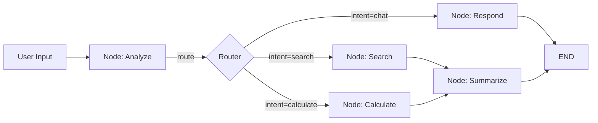
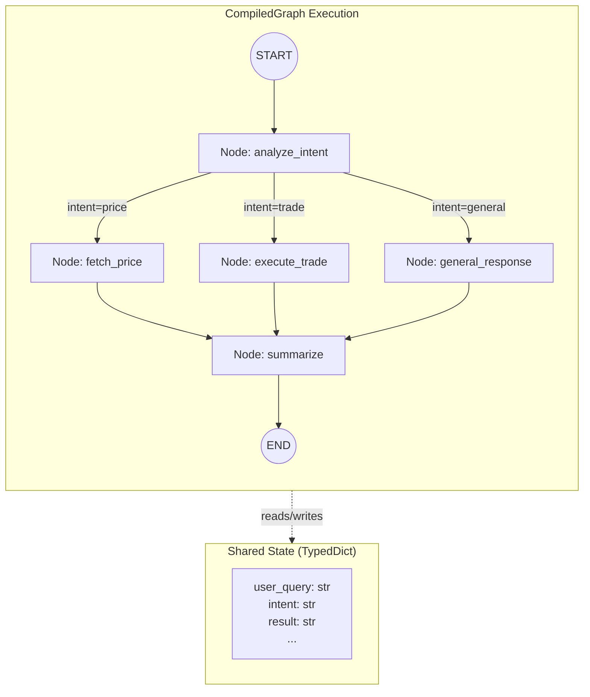
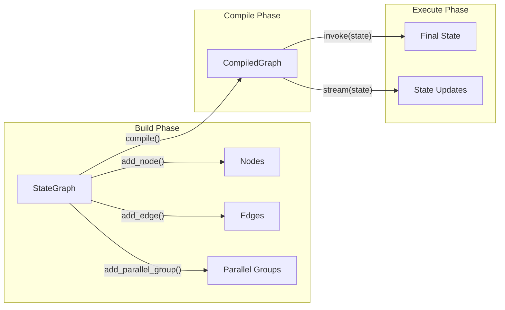
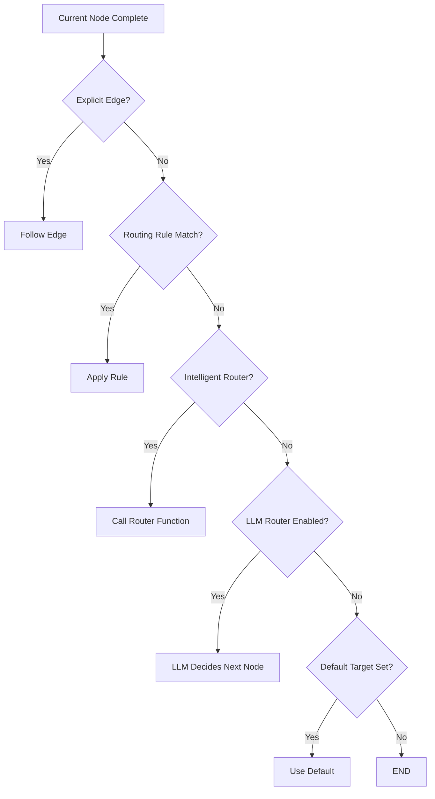

# Graph System

The SpoonOS Graph System is a library for building **stateful, multi-step AI agent workflows**. It models applications as directed graphs where **nodes** represent actions (calling an LLM, executing a tool, processing data) and **edges** define how control flows between them—including conditional branching, parallel fan-out, and cycles for iterative reasoning.

## Why Graph System?

Traditional LLM applications are often simple chains: prompt → response → done. But real-world AI agents need more:

- **State persistence** — Remember context across multiple steps and interactions
- **Conditional logic** — Take different paths based on LLM outputs or external data
- **Parallel execution** — Run multiple tasks simultaneously and combine results
- **Human-in-the-loop** — Pause for user input, approval, or correction
- **Error recovery** — Handle failures gracefully without losing progress

The Graph System makes these patterns first-class citizens, not afterthoughts.

## Key Concepts



| Concept | Description |
|---------|-------------|
| **State** | A typed dictionary (`TypedDict`) shared across all nodes. Each node reads state, performs work, and returns updates to merge back. |
| **Node** | An async function that receives state and returns a partial update. Nodes are the "actions" in your workflow. |
| **Edge** | A connection between nodes. Can be static (always go A→B), conditional (go A→B or A→C based on state), or LLM-driven. |
| **Checkpoint** | An automatic snapshot of state before each node. Enables recovery, debugging, and human-in-the-loop interrupts. |

## What Can You Build?

| Use Case | How Graph System Helps |
|----------|----------------------|
| **Autonomous Agents** | Multi-step reasoning with tool calls, observation loops, and adaptive planning |
| **RAG Pipelines** | Retrieve → Grade → Regenerate cycles with conditional routing based on relevance |
| **Multi-Agent Systems** | Multiple specialized agents collaborating via shared state and handoffs |
| **Approval Workflows** | Pause execution for human review, then resume from checkpoint |
| **Parallel Analysis** | Fan-out to multiple data sources, join results with configurable strategies |

## Graph System vs LangGraph

SpoonOS Graph System is inspired by [LangGraph](https://github.com/langchain-ai/langgraph) and shares similar concepts. Key differences:

| Feature | SpoonOS Graph | LangGraph |
|---------|---------------|-----------|
| **Parallel Groups** | Native `add_parallel_group()` with quorum joins, timeouts, circuit breakers | Manual asyncio or branching |
| **Routing Stack** | Priority-based: explicit → rules → intelligent → LLM → fallback | Conditional edges only |
| **Declarative Definition** | `GraphTemplate` / `NodeSpec` / `EdgeSpec` for serializable, composable graphs | Imperative builder only |
| **Resource Control** | Built-in rate limiting, max concurrency, circuit breakers | External implementation |
| **Web3/Crypto** | Native integration with SpoonOS toolkits (CEX, DEX, on-chain) | Via third-party tools |

Choose SpoonOS Graph when you need production-grade parallel execution, multi-layer routing, or crypto/Web3 integrations.

---

## Quick Start

```bash
pip install spoon-ai
```

```python
import asyncio
from typing import TypedDict
from spoon_ai.graph import StateGraph, END

class MyState(TypedDict):
    query: str
    result: str

async def process(state: MyState) -> dict:
    return {"result": f"Processed: {state['query']}"}

graph = StateGraph(MyState)
graph.add_node("process", process)
graph.add_edge("__start__", "process")
graph.add_edge("process", END)

app = graph.compile()

async def main():
    result = await app.invoke({"query": "Hello", "result": ""})
    print(result["result"])  # Processed: Hello

asyncio.run(main())
```

---

## Architecture



The graph system consists of three main components:

| Component | Responsibility |
|-----------|---------------|
| **`StateGraph`** | Builder class for defining workflow topology—nodes, edges, routing rules, parallel groups |
| **`CompiledGraph`** | Executable runtime that manages state transitions, checkpointing, and metrics collection |
| **`GraphAgent`** | Optional wrapper that integrates graph execution with SpoonOS agent lifecycle and memory |



---

## Core Concepts

### Nodes

A **node** is an async function that receives the current workflow state and returns a dictionary of updates to merge back into state.

```python
from typing import TypedDict, Dict, Any

class AnalysisState(TypedDict):
    user_query: str
    symbol: str
    price_data: Dict[str, Any]
    analysis: str

async def fetch_price_node(state: AnalysisState) -> dict:
    """
    Node that fetches price data for a trading symbol.

    Receives: Full state dictionary
    Returns: Dictionary of fields to update (merged into state)
    """
    symbol = state.get("symbol", "BTC")

    # Actual API call to data source
    from toolkit.crypto_power_data import CryptoPowerData
    client = CryptoPowerData()
    ohlcv = await client.get_ohlcv(symbol=f"{symbol}USDT", interval="1h", limit=24)

    return {
        "price_data": {
            "symbol": symbol,
            "current_price": ohlcv[-1]["close"],
            "high_24h": max(c["high"] for c in ohlcv),
            "low_24h": min(c["low"] for c in ohlcv),
            "volume_24h": sum(c["volume"] for c in ohlcv),
        }
    }
```

**Node contract:**

- **Input**: Receives immutable view of current state
- **Output**: Returns `dict` of fields to update (partial update, not full replacement)
- **Async**: Should be `async def` (sync functions are auto-wrapped but less efficient)
- **Idempotent**: Should produce same result given same state (for retry safety)

### Edges

**Edges** define transitions between nodes. Three types are supported:

```python
from spoon_ai.graph import StateGraph, END

graph = StateGraph(AnalysisState)

# 1. Static edge: Always transitions to target
graph.add_edge("fetch_price", "analyze")
graph.add_edge("analyze", END)

# 2. Conditional edge: Routes based on state inspection
def route_by_intent(state: AnalysisState) -> str:
    """Return key from path_map based on detected intent."""
    intent = state.get("intent", "unknown")
    if intent == "price_query":
        return "price"
    elif intent == "technical_analysis":
        return "technical"
    return "general"

graph.add_conditional_edges(
    source="classify_intent",
    condition=route_by_intent,
    path_map={
        "price": "fetch_price",
        "technical": "compute_indicators",
        "general": "general_response",
    }
)

# 3. Routing rule: Pattern-based with priorities
graph.add_routing_rule(
    source_node="entry",
    condition=lambda state, query: "bitcoin" in query.lower(),
    target_node="btc_specialist",
    priority=10  # Higher priority = checked first
)
```

### State

**State** is a shared `TypedDict` that flows through the graph. Each node reads from state and returns updates to merge.

```python
from typing import TypedDict, List, Dict, Any, Optional, Annotated

class CryptoAnalysisState(TypedDict):
    # Input fields
    user_query: str
    user_id: str

    # Intermediate fields
    intent: str
    symbol: str
    timeframes: List[str]

    # Data fields
    price_data: Dict[str, Any]
    technical_indicators: Dict[str, float]
    news_sentiment: Dict[str, Any]

    # Output fields
    analysis: str
    recommendations: List[str]
    confidence: float

    # System fields
    messages: Annotated[List[dict], "Conversation history - appended via reducer"]
    execution_log: List[str]
```

**State merge behavior:**

| Field Type | Merge Strategy |
|------------|---------------|
| `dict` | Deep merge (nested dicts merged recursively) |
| `list` | Append (capped at 100 items to prevent unbounded growth) |
| `messages` field | Uses `add_messages` reducer (append with deduplication) |
| Other types | Replace |

### Checkpointing

The graph system automatically checkpoints state before each node execution, enabling:

- **Recovery**: Resume from last successful node after failure
- **Debugging**: Inspect state at any point in execution history
- **Human-in-the-loop**: Pause execution, collect input, resume

```python
from spoon_ai.graph import InMemoryCheckpointer, StateGraph

# Configure checkpointer
checkpointer = InMemoryCheckpointer(max_checkpoints_per_thread=100)
graph = StateGraph(AnalysisState, checkpointer=checkpointer)

# After compilation, access state history
compiled = graph.compile()
result = await compiled.invoke(
    {"user_query": "Analyze BTC"},
    config={"configurable": {"thread_id": "session_123"}}
)

# Retrieve checkpoint history
config = {"configurable": {"thread_id": "session_123"}}
history = list(graph.get_state_history(config))

for checkpoint in history:
    print(f"Node: {checkpoint.metadata.get('node')}")
    print(f"Iteration: {checkpoint.metadata.get('iteration')}")
    print(f"State keys: {list(checkpoint.values.keys())}")
```

---

## Building Graphs

### Imperative API

For simple workflows, use the imperative builder methods directly:

```python
from spoon_ai.graph import StateGraph, END

graph = StateGraph(AnalysisState)

# Add nodes
graph.add_node("classify", classify_intent_node)
graph.add_node("fetch_price", fetch_price_node)
graph.add_node("analyze", analyze_node)
graph.add_node("respond", generate_response_node)

# Add edges
graph.add_edge("classify", "fetch_price")
graph.add_edge("fetch_price", "analyze")
graph.add_edge("analyze", "respond")
graph.add_edge("respond", END)

# Set entry point
graph.set_entry_point("classify")

# Compile and execute
compiled = graph.compile()
result = await compiled.invoke({"user_query": "What is BTC price?"})
```

### Declarative API

For larger workflows, use `GraphTemplate` for better maintainability:

```python
from spoon_ai.graph import StateGraph, END
from spoon_ai.graph.builder import (
    DeclarativeGraphBuilder,
    GraphTemplate,
    NodeSpec,
    EdgeSpec,
    ParallelGroupSpec,
)
from spoon_ai.graph.config import GraphConfig, ParallelGroupConfig

# Define node specifications
nodes = [
    NodeSpec("classify", classify_intent_node),
    NodeSpec("fetch_price", fetch_price_node, parallel_group="data_fetch"),
    NodeSpec("fetch_news", fetch_news_node, parallel_group="data_fetch"),
    NodeSpec("fetch_sentiment", fetch_sentiment_node, parallel_group="data_fetch"),
    NodeSpec("analyze", analyze_node),
    NodeSpec("respond", generate_response_node),
]

# Define edge specifications
edges = [
    EdgeSpec("classify", "fetch_price"),  # Entry to parallel group
    EdgeSpec("fetch_price", "analyze"),   # All parallel nodes -> analyze
    EdgeSpec("fetch_news", "analyze"),
    EdgeSpec("fetch_sentiment", "analyze"),
    EdgeSpec("analyze", "respond"),
    EdgeSpec("respond", END),
]

# Define parallel groups
parallel_groups = [
    ParallelGroupSpec(
        name="data_fetch",
        nodes=["fetch_price", "fetch_news", "fetch_sentiment"],
        config=ParallelGroupConfig(
            join_strategy="all",
            timeout=30.0,
            error_strategy="collect_errors",
        )
    )
]

# Create template
template = GraphTemplate(
    entry_point="classify",
    nodes=nodes,
    edges=edges,
    parallel_groups=parallel_groups,
    config=GraphConfig(max_iterations=50),
)

# Build graph
builder = DeclarativeGraphBuilder(AnalysisState)
graph = builder.build(template)
```

---

## Routing Strategies

The graph system evaluates routing in priority order:



### Conditional Edges

Route based on state inspection:

```python
def route_by_confidence(state: AnalysisState) -> str:
    """Route based on analysis confidence level."""
    confidence = state.get("confidence", 0.0)
    if confidence >= 0.8:
        return "high_confidence"
    elif confidence >= 0.5:
        return "medium_confidence"
    return "low_confidence"

graph.add_conditional_edges(
    "analyze",
    route_by_confidence,
    {
        "high_confidence": "generate_recommendation",
        "medium_confidence": "request_clarification",
        "low_confidence": "escalate_to_human",
    }
)
```

### LLM-Powered Routing

Enable natural language routing when patterns are complex:

```python
from spoon_ai.graph.config import GraphConfig, RouterConfig

config = GraphConfig(
    router=RouterConfig(
        allow_llm=True,
        llm_timeout=8.0,
        default_target="fallback_handler",
        allowed_targets=["price_handler", "trade_handler", "analysis_handler"],
    )
)

graph = StateGraph(AnalysisState)
graph.config = config

# Or enable after graph creation
graph.enable_llm_routing(config={
    "model": "gpt-4",
    "temperature": 0.1,
    "max_tokens": 50,
})
```

---

## Parallel Execution

Execute multiple nodes concurrently with configurable join and error strategies:

```python
from spoon_ai.graph.config import ParallelGroupConfig, ParallelRetryPolicy

# Define parallel data collection
graph.add_parallel_group(
    "market_data_collection",
    nodes=["fetch_binance", "fetch_coinbase", "fetch_kraken"],
    config=ParallelGroupConfig(
        # Join strategy
        join_strategy="quorum",  # "all", "any", "quorum"
        quorum=0.66,             # 66% must complete (2 of 3)

        # Timing
        timeout=15.0,            # Max wait time in seconds

        # Error handling
        error_strategy="collect_errors",  # "fail_fast", "collect_errors", "ignore_errors"

        # Retry policy for individual nodes
        retry_policy=ParallelRetryPolicy(
            max_retries=2,
            backoff_initial=0.5,
            backoff_multiplier=2.0,
            backoff_max=5.0,
        ),

        # Resource controls
        max_in_flight=10,                # Max concurrent tasks
        circuit_breaker_threshold=5,     # Disable group after N failures
        circuit_breaker_cooldown=30.0,   # Re-enable after cooldown
    )
)
```

**Join Strategies:**

| Strategy | Behavior | Use Case |
|----------|----------|----------|
| `"all"` | Wait for all nodes | Need complete data from all sources |
| `"any"` | Return on first success | Redundant sources, want fastest |
| `"quorum"` | Wait for majority | Fault-tolerant consensus |

**Error Strategies:**

| Strategy | Behavior | Use Case |
|----------|----------|----------|
| `"fail_fast"` | Cancel all, raise exception | Critical path, must succeed |
| `"collect_errors"` | Continue, store errors in `__errors__` | Best-effort, report issues |
| `"ignore_errors"` | Continue, discard failures | Non-critical enrichment |

---

## Human-in-the-Loop

Interrupt execution to collect user input:

```python
from spoon_ai.graph import interrupt, Command

async def confirm_trade_node(state: AnalysisState) -> dict:
    """Node that requires user confirmation before proceeding."""
    trade_details = state.get("trade_details", {})

    if not state.get("user_confirmed"):
        # Interrupt execution
        interrupt({
            "type": "confirmation_required",
            "question": f"Execute {trade_details['action']} {trade_details['amount']} {trade_details['symbol']}?",
            "trade_details": trade_details,
        })

    # This code runs after resume with confirmation
    return {"trade_executed": True, "execution_time": "2024-01-15T10:30:00Z"}

# Handling the interrupt
compiled = graph.compile()

# Initial execution - will interrupt
result = await compiled.invoke(
    {"user_query": "Buy 0.1 BTC"},
    config={"configurable": {"thread_id": "trade_session"}}
)

if "__interrupt__" in result:
    interrupt_info = result["__interrupt__"][0]
    print(f"Question: {interrupt_info['value']['question']}")

    # Get user confirmation (from UI, API, etc.)
    user_confirmed = await get_user_confirmation()

    # Resume execution with confirmation
    result = await compiled.invoke(
        Command(resume={"user_confirmed": user_confirmed}),
        config={"configurable": {"thread_id": "trade_session"}}
    )
```

---

## GraphAgent Integration

`GraphAgent` wraps graph execution with SpoonOS agent lifecycle and persistent memory:

```python
from spoon_ai.graph import StateGraph, GraphAgent, Memory

# Build graph
graph = build_analysis_graph()

# Create agent with memory
agent = GraphAgent(
    name="crypto_analyzer",
    graph=graph,
    memory_path="./agent_memory",
    session_id="user_123_session",
    preserve_state=True,  # Preserve state between runs
)

# Execute
result = await agent.run("Analyze BTC price trends")
print(result)

# Access execution metadata
metadata = agent.get_execution_metadata()
print(f"Successful: {metadata.get('execution_successful')}")

# Memory operations
agent.set_memory_metadata("last_analysis_time", "2024-01-15T10:30:00Z")
stats = agent.get_memory_statistics()
print(f"Total messages: {stats['total_messages']}")

# Search memory
matches = agent.search_memory("bitcoin", limit=5)

# Switch sessions
agent.load_session("user_456_session")
```

---

## Monitoring and Debugging

### Execution Metrics

```python
# Enable monitoring
graph.enable_monitoring([
    "execution_time",
    "success_rate",
    "routing_performance",
])

compiled = graph.compile()
result = await compiled.invoke(initial_state)

# Retrieve metrics
metrics = compiled.get_execution_metrics()
print(f"""
Execution Summary:
  Total executions: {metrics['total_executions']}
  Success rate: {metrics['success_rate']:.1%}
  Avg execution time: {metrics['avg_execution_time']:.3f}s

Per-Node Statistics:
""")
for node, stats in metrics['node_stats'].items():
    print(f"  {node}:")
    print(f"    Calls: {stats['count']}")
    print(f"    Avg time: {stats['avg_time']:.3f}s")
    print(f"    Error rate: {stats['error_rate']:.1%}")
```

### Execution History

```python
# Get detailed execution history
history = compiled.get_execution_history()

for step in history:
    print(f"""
Step: {step['node']}
  Iteration: {step['iteration']}
  Success: {step['success']}
  Execution time: {step['execution_time']:.3f}s
  Timestamp: {step['timestamp']}
""")
```

---

## Configuration Reference

### GraphConfig

```python
from spoon_ai.graph.config import GraphConfig, RouterConfig

config = GraphConfig(
    # Execution limits
    max_iterations=100,              # Maximum node transitions per invoke()

    # Router configuration
    router=RouterConfig(
        allow_llm=False,             # Enable LLM-based routing
        allowed_targets=None,        # Restrict valid routing targets (None = all)
        default_target=None,         # Fallback target when no route matches
        llm_timeout=8.0,             # Timeout for LLM router calls
        enable_fallback_to_default=True,  # Use default_target on routing failure
    ),

    # Validation
    state_validators=[],             # List of (state) -> None functions

    # Pre-configured parallel groups
    parallel_groups={},              # name -> ParallelGroupConfig
)
```

### ParallelGroupConfig

```python
from spoon_ai.graph.config import ParallelGroupConfig, ParallelRetryPolicy

config = ParallelGroupConfig(
    # Join behavior
    join_strategy="all",             # "all", "any", "quorum"
    quorum=None,                     # For quorum: 0.0-1.0 (ratio) or int (count)
    join_condition=None,             # Optional: async (state, completed_nodes) -> bool

    # Timing
    timeout=None,                    # Max wait time in seconds (None = unlimited)

    # Error handling
    error_strategy="fail_fast",      # "fail_fast", "collect_errors", "ignore_errors"
    retry_policy=ParallelRetryPolicy(
        max_retries=0,               # Retries per node
        backoff_initial=0.5,         # Initial backoff delay
        backoff_multiplier=2.0,      # Backoff multiplier
        backoff_max=10.0,            # Maximum backoff delay
    ),

    # Resource controls
    max_in_flight=None,              # Max concurrent tasks (None = unlimited)
    rate_limit_per_second=None,      # Rate limit (None = unlimited)

    # Circuit breaker
    circuit_breaker_threshold=None,  # Disable after N failures
    circuit_breaker_cooldown=30.0,   # Re-enable after cooldown seconds
)
```

---

## Best Practices

### Node Design

1. **Single responsibility**: Each node should do one thing. Split complex logic across multiple nodes.

2. **Idempotency**: Nodes should produce the same result given the same state (enables safe retries).

3. **Minimal state updates**: Return only changed fields. The system handles merging.

```python
# Good: Returns only updated fields
async def good_node(state):
    return {"result": "computed value"}

# Avoid: Returns entire state copy
async def avoid_node(state):
    new_state = state.copy()
    new_state["result"] = "computed value"
    return new_state
```

### State Management

1. **Type your state**: Use `TypedDict` for IDE support and documentation.

2. **Bound list growth**: Use reducers or explicit trimming to prevent unbounded lists.

3. **Avoid large objects**: State is checkpointed frequently. Keep it JSON-serializable and reasonably sized.

### Error Handling

1. **Use appropriate error strategies**: `fail_fast` for critical paths, `collect_errors` for best-effort.

2. **Add validation**: Use `state_validators` to catch invalid state early.

3. **Log in nodes**: Include context in error messages for debugging.

```python
async def robust_node(state):
    try:
        result = await external_api_call(state["symbol"])
        return {"data": result}
    except ExternalAPIError as e:
        logger.error(f"API call failed for {state['symbol']}: {e}")
        return {"error": str(e), "data": None}
```

---

## Examples

- **[Intent Graph Demo](../examples/intent-graph-demo.md)** — Intelligent routing with parallel execution
  ([source](https://github.com/XSpoonAi/spoon-core/blob/main/examples/intent_graph_demo.py))

- **[Graph Crypto Analysis](../examples/graph-crypto-analysis.md)** — Real-time market analysis pipeline
  ([source](https://github.com/XSpoonAi/spoon-core/blob/main/examples/graph_crypto_analysis.py))

## Related Documentation

- **[Agents](./agents.md)** — When to use `GraphAgent` vs `ReActAgent`
- **[Tools Integration](./tools.md)** — Adding tools to graph nodes
- **[MCP Protocol](./mcp-protocol.md)** — Dynamic tool discovery in workflows
