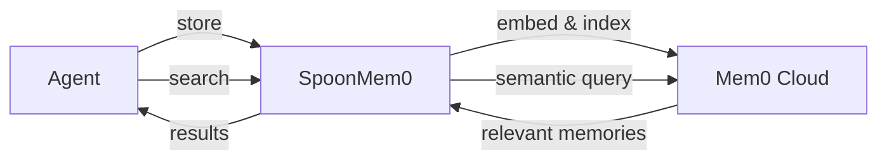

# Long-Term Memory

Long-term memory lets your agent **remember across sessions**. Unlike short-term memory (which resets each conversation), long-term memory persists indefinitely—enabling personalized experiences, learning from past interactions, and building knowledge over time.

## Why Long-Term Memory?

Without long-term memory, every conversation starts from zero:

```text
Session 1: User: "I prefer dark mode"    Agent: "Got it!"
Session 2: User: "Change my settings"    Agent: "What settings?" ← forgot everything
```

With long-term memory:

```text
Session 1: User: "I prefer dark mode"    Agent: "Got it!" → saves to memory
Session 2: User: "Change my settings"    Agent: "I'll enable dark mode for you" ← remembers
```

## How It Works

SpoonOS integrates with [Mem0](https://mem0.ai), a managed memory service that handles storage, indexing, and semantic search:



| Feature | How It Helps |
|---------|--------------|
| **Semantic search** | Find memories by meaning: "user preferences" finds "I like dark mode" |
| **Auto-scoping** | Memories are isolated per user/agent automatically |
| **Graceful fallback** | If Mem0 is down, operations return empty (no crashes) |

## What Can You Store?

| Memory Type | Example |
|-------------|---------|
| **Preferences** | "User prefers concise responses" |
| **Facts** | "User's portfolio includes BTC and ETH" |
| **Context** | "User is a day trader focused on meme coins" |
| **History** | "User asked about Solana DeFi protocols last week" |

---

## Quick Start

```bash
pip install spoon-ai mem0ai
export MEM0_API_KEY="your-mem0-key"
```

```python
from spoon_ai.memory.mem0_client import SpoonMem0

mem0 = SpoonMem0({"user_id": "user_123"})

# Store and search
mem0.add_text("User prefers dark mode")
results = mem0.search_memory("UI preferences")
print(results)
```

---

**Core class:** `spoon_ai.memory.mem0_client.SpoonMem0`

### Initialization

```python
from spoon_ai.memory.mem0_client import SpoonMem0

mem0 = SpoonMem0({
    "api_key": os.getenv("MEM0_API_KEY"),   # or MEM0_API_KEY env var
    "user_id": "user_123",            # scope all operations to this user
    "collection": "my_namespace",     # optional namespace isolation
    "metadata": {"project": "demo"},  # auto-attached to writes
    # filters should use allowed fields: user_id, agent_id, metadata, etc.
    # "filters": {"metadata": {"project": "demo"}},  # if needed, use metadata wrapper
    "async_mode": False,              # sync writes (default)
})

if not mem0.is_ready():
    print("Mem0 service unavailable")
```

### Add Memory

Store conversation history or individual text:

```python
# Add conversation messages
mem0.add_memory([
    {"role": "user", "content": "I love Solana meme coins"},
    {"role": "assistant", "content": "Got it, focusing on Solana"},
], user_id="user_123")

# Add single text (shorthand)
mem0.add_text("User prefers low gas fees")
```

Async variant: `await mem0.aadd_memory(messages, user_id=...)`

### Search memory
```python
results = mem0.search_memory(
    "Solana meme coins high risk",
    user_id="user_123",
    limit=5,
)
for r in results:  # results is a list of strings extracted from Mem0 responses
    print("-", r)
```

Async variant: `await mem0.asearch_memory(query, user_id=...)`

### Get all memory
```python
all_memories = mem0.get_all_memory(user_id="user_123", limit=20)  # returns [] if client is not ready or call fails
```

## Demo: Intelligent Web3 Portfolio Assistant
Path: `[examples/mem0_tool_agent.py](https://github.com/XSpoonAi/spoon-toolkit/blob/main/examples/mem0_tool_agent.py)`

Key idea: The agent (ChatBot) is configured with Mem0 so it can recall user preferences after restart.

```python
from spoon_ai.chat import ChatBot

USER_ID = "crypto_whale_001"
SYSTEM_PROMPT = "...portfolio assistant..."

mem0_config = {
    "user_id": USER_ID,
    "metadata": {"project": "web3-portfolio-assistant"},
    "async_mode": False,  # sync writes so next query sees the data
}

# Create an LLM with long-term memory enabled
llm = ChatBot(
    llm_provider="openrouter",
    model_name="openai/gpt-5.1",
    enable_long_term_memory=True,
    mem0_config=mem0_config,
)
```

Flow:
1) **Session 1** – capture preferences: user says they are a high-risk Solana meme trader; model replies; Mem0 stores the interaction.
2) **Session 2** – reload a fresh ChatBot with the same `mem0_config`; the agent recalls past preferences (via Mem0 search) before answering.
3) **Session 3** – user pivots to safe Arbitrum yield; new info is stored; subsequent queries reflect updated preferences.

[]
Run the demo:
```bash
python examples/mem0_tool_agent.py
```

## Notes & Best Practices
- Always set `MEM0_API_KEY` or pass `api_key` in `mem0_config`.
- Use a stable `user_id` (or `agent_id`) so memories stay scoped; include `collection`/`filters` if you want stricter isolation. The wrapper injects `user_id` into filters and metadata if missing.
- Keep `async_mode=False` during demos/tests to avoid read-after-write delays; the wrapper always uses `mem0_config.get("async_mode", False)` for adds (no per-call override).
- Handle absence gracefully: `SpoonMem0.is_ready()` lets you disable LTM if Mem0 isn’t installed or configured; helpers will otherwise return empty results when the client is unavailable.
