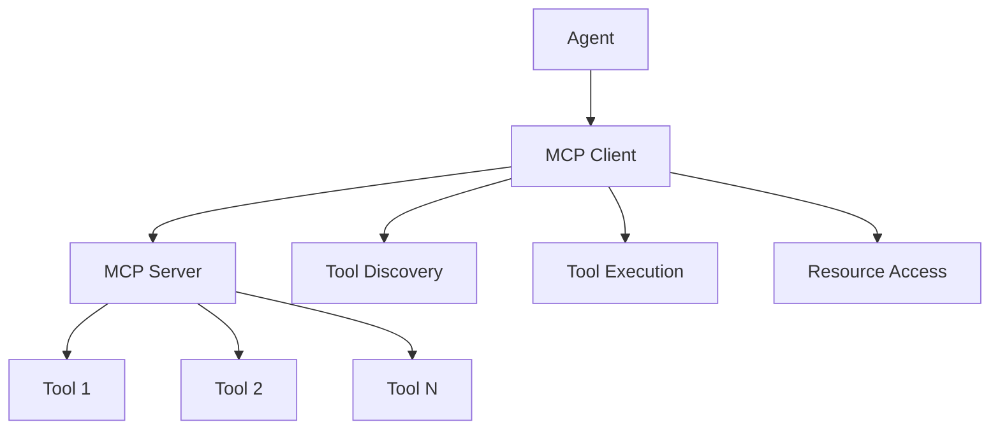

# MCP Protocol

The Model Context Protocol (MCP) enables dynamic tool discovery and execution, allowing agents to access external capabilities at runtime.

## What is MCP?

MCP is a standardized protocol that allows AI agents to:

- **Discover** available tools and resources dynamically
- **Execute** tools with proper parameter validation
- **Access** external APIs and services seamlessly
- **Extend** capabilities without code changes

## How MCP Works

### Architecture Overview



### MCP Components

1. **MCP Server** - Hosts tools and resources
2. **MCP Client** - Connects agents to servers
3. **Tools** - Executable functions with defined schemas
4. **Resources** - Data sources and content

## Setting Up MCP

### Basic MCP Server

```python
from spoon_ai.tools.mcp_tools_collection import MCPToolsCollection

# Initialize MCP tools collection
mcp_tools = MCPToolsCollection()

# Start MCP server
await mcp_tools.start_server(port=8000)
```

### MCP Client Configuration

```python
from spoon_ai.agents.mcp_client_mixin import MCPClientMixin
from spoon_ai.agents import SpoonReactAI

# Create agent with MCP capabilities
agent = SpoonReactAI(
    llm=ChatBot(model_name="gpt-4.1", llm_provider="openai"),
    mcp_servers=["http://localhost:8000"]
)
```

## Tool Discovery

### Automatic Discovery

```python
# Discover all available tools
tools = await mcp_tools.discover_tools()

for tool in tools:
    print(f"Tool: {tool.name}")
    print(f"Description: {tool.description}")
    print(f"Parameters: {tool.parameters}")
```

### Tool Registration

```python
from spoon_ai.tools.base import BaseTool

class WeatherTool(BaseTool):
    name = "get_weather"
    description = "Get current weather for a location"
    parameters = {
        "type": "object",
        "properties": {
            "location": {"type": "string", "description": "City name"}
        },
        "required": ["location"]
    }

    async def execute(self, location: str) -> dict:
        # Weather API call implementation
        return {"location": location, "temperature": 22, "condition": "sunny"}

# Register tool with MCP server
mcp_tools.register_tool(WeatherTool())
```

## Tool Execution

### Direct Execution

```python
# Execute tool directly
result = await mcp_tools.execute_tool(
    tool_name="get_weather",
    parameters={"location": "New York"}
)
```

### Agent-Driven Execution

```python
# Agent automatically discovers and uses tools
response = await agent.run("What's the weather like in San Francisco?")
# Agent will discover weather tool and execute it automatically
```

## Advanced MCP Features

### Resource Access

```python
# Access external resources through MCP
class DocumentResource:
    def __init__(self, uri: str):
        self.uri = uri

    async def read(self) -> str:
        # Read document content
        return "Document content here"

# Register resource
mcp_tools.register_resource("document://example.txt", DocumentResource)
```

### Tool Chaining

```python
# Tools can call other tools through MCP
class AnalysisTool(BaseTool):
    async def execute(self, data_source: str) -> dict:
        # Get data using another tool
        data = await self.mcp_client.execute_tool("fetch_data", {"source": data_source})

        # Process data
        analysis = self.analyze(data)
        return analysis
```

### Error Handling

The framework provides automatic error handling for MCP operations:

```python
# Framework handles errors automatically with graceful degradation
result = await mcp_tools.execute_tool("weather_tool", {"location": "New York"})

# Automatic handling includes:
# - Tool not found: Returns informative error message
# - Connection failures: Automatic retry with backoff
# - Timeout errors: Graceful timeout with fallback
# - Server unavailable: Automatic server switching if configured
```

## MCP Configuration

### Server Configuration

```json
{
  "mcp": {
    "servers": [
      {
        "name": "local_tools",
        "url": "http://localhost:8000",
        "timeout": 30
      },
      {
        "name": "external_api",
        "url": "https://api.example.com/mcp",
        "auth": {
          "type": "bearer",
          "token": "your_token_here"
        }
      }
    ]
  }
}
```

### Client Configuration

```python
from spoon_ai.tools.mcp_client import MCPClient

# Configure MCP client
client = MCPClient(
    servers=[
        "http://localhost:8000",
        "https://api.example.com/mcp"
    ],
    timeout=30,
    retry_attempts=3
)
```

## Security Considerations

### Authentication

```python
# Server-side authentication
class AuthenticatedMCPServer:
    def __init__(self, api_key: str):
        self.api_key = api_key

    def authenticate(self, request_key: str) -> bool:
        return request_key == self.api_key
```

### Tool Permissions

```python
# Define tool permissions
class RestrictedTool(BaseTool):
    required_permissions = ["read_data", "write_files"]

    async def execute(self, **kwargs):
        # Check permissions before execution
        if not self.check_permissions():
            raise PermissionError("Insufficient permissions")

        return await self.perform_action(**kwargs)
```

### Input Validation

```python
# Validate tool inputs
class SecureTool(BaseTool):
    async def execute(self, user_input: str) -> str:
        # Sanitize input
        clean_input = self.sanitize_input(user_input)

        # Validate against schema
        if not self.validate_input(clean_input):
            raise ValueError("Invalid input")

        return await self.process(clean_input)
```

## Performance Optimization

### Connection Pooling

```python
# Use connection pooling for multiple MCP servers
from spoon_ai.tools.mcp_pool import MCPConnectionPool

pool = MCPConnectionPool(
    servers=["http://server1:8000", "http://server2:8000"],
    max_connections=10,
    timeout=30
)
```

### Caching

```python
# Cache tool discovery results
from spoon_ai.tools.mcp_cache import MCPCache

cache = MCPCache(ttl=300)  # 5-minute cache
tools = await cache.get_or_fetch("tools", mcp_tools.discover_tools)
```

### Async Operations

```python
# Execute multiple tools concurrently
import asyncio

async def parallel_execution():
    tasks = [
        mcp_tools.execute_tool("tool1", {"param": "value1"}),
        mcp_tools.execute_tool("tool2", {"param": "value2"}),
        mcp_tools.execute_tool("tool3", {"param": "value3"})
    ]

    results = await asyncio.gather(*tasks)
    return results
```

## Common Use Cases

### API Integration

```python
# Integrate external APIs through MCP
class APITool(BaseTool):
    name = "api_call"

    async def execute(self, endpoint: str, method: str = "GET") -> dict:
        async with aiohttp.ClientSession() as session:
            async with session.request(method, endpoint) as response:
                return await response.json()
```

### Database Access

```python
# Database operations through MCP
class DatabaseTool(BaseTool):
    name = "query_database"

    async def execute(self, query: str) -> list:
        # Execute database query
        return await self.db.execute(query)
```

### File Operations

```python
# File system operations
class FileTool(BaseTool):
    name = "read_file"

    async def execute(self, filepath: str) -> str:
        with open(filepath, 'r') as f:
            return f.read()
```

## Best Practices

### Tool Design

- **Clear naming** - Use descriptive tool names
- **Comprehensive schemas** - Define complete parameter schemas
- **Error handling** - Leverage framework's automatic error handling
- **Documentation** - Provide clear descriptions and examples

### Performance

- **Connection reuse** - Reuse MCP connections when possible
- **Caching** - Cache discovery results and frequently used data
- **Timeouts** - Set appropriate timeouts for tool execution

### Security

- **Input validation** - Always validate tool inputs
- **Authentication** - Implement proper authentication mechanisms
- **Permissions** - Use least-privilege access principles

### Error Handling Philosophy

The SpoonOS framework follows a "fail-fast, recover-gracefully" approach for MCP operations:

- **Automatic Recovery**: Connection failures, timeouts, and server errors are handled automatically
- **Graceful Degradation**: When tools are unavailable, the system provides meaningful fallbacks
- **Minimal Manual Handling**: Let the framework handle errors; only intervene for custom business logic

```python
# Preferred: Let framework handle MCP errors
result = await mcp_tools.execute_tool("weather_tool", {"location": "NYC"})

# Framework automatically handles:
# - Server connection issues
# - Tool discovery failures
# - Execution timeouts
# - Parameter validation errors
```

## Troubleshooting

### Common Issues

#### Connection Errors

The framework automatically handles connection failures with built-in retry mechanisms:

```python
# Framework handles connection failures automatically
await mcp_client.connect()  # Automatic retry with exponential backoff
```

#### Tool Discovery Failures

```python
# Framework provides graceful handling of discovery issues
tools = await mcp_tools.discover_tools()
# Automatic fallback to cached tools if server unavailable
```

#### Execution Timeouts

```python
# Framework manages timeouts automatically
result = await mcp_tools.execute_tool("slow_tool", {})
# Automatic timeout handling with configurable limits
```

## Next Steps

### 📚 **MCP Implementation Examples**

#### 🔍 [MCP Spoon Search Agent](../examples/mcp-spoon-search-agent.md)
**GitHub**: [View Source](https://github.com/XSpoonAi/spoon-core/blob/main/examples/mcp/spoon_search_agent.py)

**What it demonstrates:**
- Complete MCP server integration and tool discovery
- Real-world MCP implementation with Tavily web search
- Dynamic tool loading and orchestration
- Production-ready MCP error handling and recovery

**Key features:**
- Tavily MCP server integration via `npx tavily-mcp`
- Automatic tool discovery and validation
- Seamless integration with existing SpoonOS architecture
- Advanced error handling for MCP server failures

**Learning outcomes:**
- How to initialize and manage MCP servers
- Dynamic tool discovery patterns
- MCP server error handling and recovery
- Integration of MCP tools with LLM workflows

### 🛠️ **Development Resources**

- **[Tools System](./tools.md)** - Learn about the complete tool ecosystem
- **[Custom Tool Development](../how-to-guides/add-custom-tools.md)** - Build MCP-compatible tools
- **[MCP Tool Reference](../api-reference/tools/builtin-tools.md)** - MCP-specific tool documentation

### 📖 **Additional Resources**

- **[Graph System](../core-concepts/graph-system.md)** - Advanced workflow orchestration
- **[Agent Architecture](../core-concepts/agents.md)** - Agent-MCP integration patterns
- **[API Reference](../api-reference/)** - Complete SpoonOS API documentation
**GitHub**: [View Source](https://github.com/XSpoonAi/spoon-ai/tree/main/spoon-cookbook/example/spoon_search_agent.py)

**What it demonstrates:**
- Complete MCP server integration and tool discovery
- Real-world MCP implementation with Tavily web search
- Dynamic tool loading and orchestration
- Production-ready MCP error handling and recovery

**Key features:**
- Tavily MCP server integration via `npx tavily-mcp`
- Automatic tool discovery and validation
- Seamless integration with existing SpoonOS architecture
- Advanced error handling for MCP server failures

**Learning outcomes:**
- How to initialize and manage MCP servers
- Dynamic tool discovery patterns
- MCP server error handling and recovery
- Integration of MCP tools with LLM workflows

### 🛠️ **Development Resources**

- **[Tools System](./tools.md)** - Learn about the complete tool ecosystem
- **[Custom Tool Development](../how-to-guides/add-custom-tools.md)** - Build MCP-compatible tools
- **[MCP Tool Reference](../api-reference/tools/builtin-tools.md)** - MCP-specific tool documentation

### 📖 **Additional Resources**

- **[Graph System](../core-concepts/graph-system.md)** - Advanced workflow orchestration
- **[Agent Architecture](../core-concepts/agents.md)** - Agent-MCP integration patterns
- **[API Reference](../api-reference/)** - Complete SpoonOS API documentation