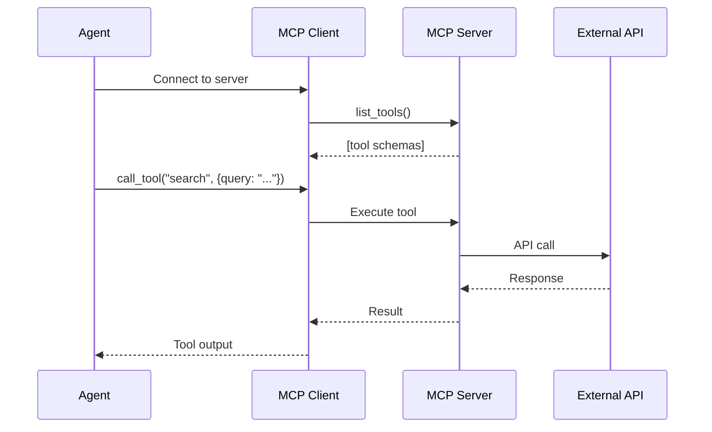
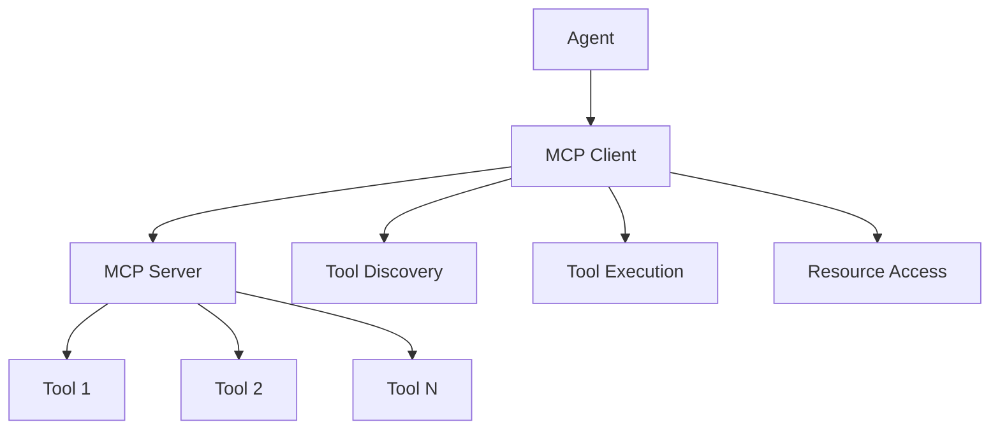

# MCP Protocol

The **Model Context Protocol (MCP)** is an open standard for connecting AI agents to external tools and data sources. Instead of hardcoding tool integrations, agents discover tools dynamically at runtime—enabling modular, federated ecosystems where tools can be shared across different AI applications.

## Why MCP?

Traditional tool integration is brittle:

```text
❌ Old way: Agent ↔ Hardcoded Tool A ↔ Hardcoded Tool B ↔ Hardcoded Tool C
✅ MCP way: Agent ↔ MCP Client ↔ Any MCP Server (tools discovered at runtime)
```

With MCP, your agent can:

- **Discover tools dynamically** — No code changes when tools are added or updated
- **Connect to any MCP server** — Use tools from Cursor, Claude Desktop, or custom servers
- **Share tools across apps** — One MCP server can serve multiple agents
- **Hot-reload** — Update tool definitions without redeploying

## How It Works



| Concept | Description |
|---------|-------------|
| **MCP Server** | Exposes tools via a standard protocol. Can run as subprocess (stdio), HTTP/SSE, or WebSocket. |
| **MCP Client** | Connects to servers, discovers tools, and executes them on behalf of agents. |
| **Tool Schema** | JSON-schema definition of tool name, description, and parameters—fetched at runtime. |
| **Resources** | Optional: MCP also supports resource URIs for documents, databases, and other data. |

## MCP vs Other Approaches

| Aspect | MCP | OpenAI Plugins | Hardcoded Tools |
|--------|-----|----------------|-----------------|
| **Discovery** | Runtime `list_tools()` | Manifest file at URL | Compile-time |
| **Transport** | stdio, SSE, WebSocket | HTTPS only | In-process |
| **Ecosystem** | Cursor, Claude, SpoonOS, etc. | ChatGPT only | Single app |
| **Updates** | Hot-reload, no redeploy | Redeploy plugin | Redeploy app |

---

## Quick Start

```bash
pip install spoon-ai
```

```python
import asyncio
from spoon_ai.mcp import MCPClient

async def main():
    async with MCPClient.from_config({
        "command": "npx",
        "args": ["-y", "@anthropic/mcp-server-filesystem", "/tmp"]
    }) as client:
        tools = await client.list_tools()
        result = await client.call_tool("read_file", {"path": "/tmp/test.txt"})
        print(result)

asyncio.run(main())
```

---

## Architecture



### MCP Components

1. **MCP Server** - Hosts tools and resources
2. **MCP Client** - Connects agents to servers
3. **Tools** - Executable functions with defined schemas
4. **Resources** - Data sources and content

## Setting Up MCP

### Basic MCP Server

```python
import asyncio
from spoon_ai.tools.mcp_tools_collection import MCPToolsCollection

mcp_tools = MCPToolsCollection()

async def main():
    # Runs a FastMCP SSE server. Change the port as needed.
    await mcp_tools.run(port=8765)

asyncio.run(main())
```

### MCP Client Configuration

```python
import asyncio
from spoon_ai.agents.mcp_client_mixin import MCPClientMixin

class MCPEnabledClient(MCPClientMixin):
    def __init__(self, transport: str):
        super().__init__(transport)

client = MCPEnabledClient("ws://localhost:8765")

async def list_tools():
    async with client.get_session() as session:
        return await session.list_tools()

tools = asyncio.run(list_tools())
for tool in tools:
    print(f"{tool.name}: {tool.description}")
```

## Tool Discovery

### Automatic Discovery

```python
async def discover_tools():
    async with client.get_session() as session:
        return await session.list_tools()

tools = asyncio.run(discover_tools())
for tool in tools:
    print(tool.name)
```

### Tool Registration

```python
from spoon_ai.tools.base import BaseTool
from spoon_ai.tools.mcp_tools_collection import mcp_tools

class WeatherTool(BaseTool):
    name: str = "get_weather"
    description: str = "Get current weather for a location"
    parameters: dict = {
        "type": "object",
        "properties": {
            "location": {"type": "string", "description": "City name"}
        },
        "required": ["location"]
    }

    async def execute(self, location: str) -> dict:
        # Weather API call implementation
        return {"location": location, "temperature": 22, "condition": "sunny"}

# Register tool with the running MCP server
asyncio.run(mcp_tools.add_tool(WeatherTool()))
```

## Tool Execution

### Direct Execution

```python
# Execute tool via MCP client
result = asyncio.run(client.call_mcp_tool("get_weather", location="New York"))
print(result)
```

### Agent-Driven Execution

```python
from spoon_ai.agents.spoon_react_mcp import SpoonReactMCP

# Agent that can consume MCP tools discovered via its transport
agent = SpoonReactMCP()
response = await agent.run("What's the weather like in San Francisco?")
print(response)
```

## MCP Configuration

### Server Configuration

```json
{
  "mcp": {
    "servers": [
      {
        "name": "local_tools",
        "url": "http://localhost:8000",
        "timeout": 30
      },
      {
        "name": "external_api",
        "url": "https://api.example.com/mcp",
        "auth": {
          "type": "bearer",
          "token": "your_token_here"
        }
      }
    ]
  }
}
```

### Client Configuration

```python
from spoon_ai.agents.mcp_client_mixin import MCPClientMixin


class ConfiguredMCPClient(MCPClientMixin):
    def __init__(self, transport: str, *, timeout: int = 30):
        super().__init__(transport)
        self.timeout = timeout


# Configure MCP client using FastMCP transport (SSE/WS)
client = ConfiguredMCPClient("ws://localhost:8765", timeout=30)
```

## Security Considerations

### Authentication

> **Note:** `AuthenticatedMCPServer` is a conceptual example and not shipped in `spoon_ai`. Implement authentication using your FastMCP server framework (e.g., middleware or request hooks).

```python
# Server-side authentication
class AuthenticatedMCPServer:
    def __init__(self, api_key: str):
        self.api_key = api_key

    def authenticate(self, request_key: str) -> bool:
        return request_key == self.api_key
```

### Tool Permissions

```python
# Define tool permissions
class RestrictedTool(BaseTool):
    required_permissions = ["read_data", "write_files"]

    async def execute(self, **kwargs):
        # Check permissions before execution
        if not self.check_permissions():
            raise PermissionError("Insufficient permissions")

        return await self.perform_action(**kwargs)
```

### Input Validation

```python
# Validate tool inputs
class SecureTool(BaseTool):
    async def execute(self, user_input: str) -> str:
        # Sanitize input
        clean_input = self.sanitize_input(user_input)

        # Validate against schema
        if not self.validate_input(clean_input):
            raise ValueError("Invalid input")

        return await self.process(clean_input)
```

## Performance Optimization

### Connection Pooling

> **Note:** `MCPConnectionPool` is not provided by `spoon_ai`. The `MCPClientMixin` already reuses sessions per task; wrap it or your FastMCP client in your own pooling logic if you need cross-server pooling.

```python
# Reuse sessions via MCPClientMixin (simplest pooling strategy)
from spoon_ai.agents.mcp_client_mixin import MCPClientMixin

class PooledMCPClient(MCPClientMixin):
    def __init__(self, transport: str):
        super().__init__(transport)

client = PooledMCPClient("ws://localhost:8765")

async def use_pool():
    async with client.get_session() as session:
        return await session.list_tools()
```

### Caching

> **Note:** `MCPCache` is not included in `spoon_ai`. Use a simple in-memory cache or a library like `functools.lru_cache` for discovery results.

```python
# Minimal in-memory cache for tool discovery
tool_cache: dict[str, list] = {}

async def get_tools_cached():
    if "tools" not in tool_cache:
        tool_cache["tools"] = await mcp_tools.discover_tools()
    return tool_cache["tools"]
```

### Async Operations

```python
# Execute multiple tools concurrently
import asyncio

async def parallel_execution():
    tasks = [
        mcp_tools.execute_tool("tool1", {"param": "value1"}),
        mcp_tools.execute_tool("tool2", {"param": "value2"}),
        mcp_tools.execute_tool("tool3", {"param": "value3"})
    ]

    results = await asyncio.gather(*tasks)
    return results
```

## Common Use Cases

### API Integration

```python
# Integrate external APIs through MCP
class APITool(BaseTool):
    name = "api_call"

    async def execute(self, endpoint: str, method: str = "GET") -> dict:
        async with aiohttp.ClientSession() as session:
            async with session.request(method, endpoint) as response:
                return await response.json()
```

### Database Access

```python
# Database operations through MCP
class DatabaseTool(BaseTool):
    name = "query_database"

    async def execute(self, query: str) -> list:
        # Execute database query
        return await self.db.execute(query)
```

### File Operations

```python
# File system operations
class FileTool(BaseTool):
    name = "read_file"

    async def execute(self, filepath: str) -> str:
        with open(filepath, 'r') as f:
            return f.read()
```

## Best Practices

### Tool Design

- **Clear naming** - Use descriptive tool names
- **Comprehensive schemas** - Define complete parameter schemas
- **Error handling** - Leverage framework's automatic error handling
- **Documentation** - Provide clear descriptions and examples

### Performance

- **Connection reuse** - Reuse MCP connections when possible
- **Caching** - Cache discovery results and frequently used data
- **Timeouts** - Set appropriate timeouts for tool execution

### Security

- **Input validation** - Always validate tool inputs
- **Authentication** - Implement proper authentication mechanisms
- **Permissions** - Use least-privilege access principles

### Error Handling Philosophy

The SpoonOS framework follows a "fail-fast, recover-gracefully" approach for MCP operations:

- **Automatic Recovery**: Connection failures, timeouts, and server errors are handled automatically
- **Graceful Degradation**: When tools are unavailable, the system provides meaningful fallbacks
- **Minimal Manual Handling**: Let the framework handle errors; only intervene for custom business logic

```python
# Preferred: Let framework handle MCP errors
result = await mcp_tools.execute_tool("weather_tool", {"location": "NYC"})

# Framework automatically handles:
# - Server connection issues
# - Tool discovery failures
# - Execution timeouts
# - Parameter validation errors
```

## Troubleshooting

### Common Issues

#### Connection Errors

The framework automatically handles connection failures with built-in retry mechanisms:

```python
# Framework handles connection failures automatically
await mcp_client.connect()  # Automatic retry with exponential backoff
```

#### Tool Discovery Failures

```python
# Framework provides graceful handling of discovery issues
tools = await mcp_tools.discover_tools()
# Automatic fallback to cached tools if server unavailable
```

#### Execution Timeouts

```python
# Framework manages timeouts automatically
result = await mcp_tools.execute_tool("slow_tool", {})
# Automatic timeout handling with configurable limits
```

## Next Steps

### 📚 **MCP Implementation Examples**

#### 🔍 [MCP Spoon Search Agent](../examples/mcp-spoon-search-agent.md)
**GitHub**: [View Source](https://github.com/XSpoonAi/spoon-core/blob/main/examples/mcp/spoon_search_agent.py)

**What it demonstrates:**
- Complete MCP server integration and tool discovery
- Real-world MCP implementation with Tavily web search
- Dynamic tool loading and orchestration
- Production-ready MCP error handling and recovery

**Key features:**
- Tavily MCP server integration via `npx tavily-mcp`
- Automatic tool discovery and validation
- Seamless integration with existing SpoonOS architecture
- Advanced error handling for MCP server failures

**Learning outcomes:**
- How to initialize and manage MCP servers
- Dynamic tool discovery patterns
- MCP server error handling and recovery
- Integration of MCP tools with LLM workflows

### 🛠️ **Development Resources**

- **[Tools System](./tools.md)** - Learn about the complete tool ecosystem
- **[Custom Tool Development](../how-to-guides/add-custom-tools.md)** - Build MCP-compatible tools
- **[MCP Tool Reference](../api-reference/spoon_ai/tools/)** - MCP-specific tool documentation

### 📖 **Additional Resources**

- **[Graph System](../core-concepts/graph-system.md)** - Advanced workflow orchestration
- **[Agent Architecture](../core-concepts/agents.md)** - Agent-MCP integration patterns
- **[API Reference](../api-reference/index)** - Complete SpoonOS API documentation
**GitHub**: [View Source](https://github.com/XSpoonAi/spoon-core/blob/main/examples/mcp/spoon_search_agent.py)

**What it demonstrates:**
- Complete MCP server integration and tool discovery
- Real-world MCP implementation with Tavily web search
- Dynamic tool loading and orchestration
- Production-ready MCP error handling and recovery

**Key features:**
- Tavily MCP server integration via `npx tavily-mcp`
- Automatic tool discovery and validation
- Seamless integration with existing SpoonOS architecture
- Advanced error handling for MCP server failures

**Learning outcomes:**
- How to initialize and manage MCP servers
- Dynamic tool discovery patterns
- MCP server error handling and recovery
- Integration of MCP tools with LLM workflows

### 🛠️ **Development Resources**

- **[Tools System](./tools.md)** - Learn about the complete tool ecosystem
- **[Custom Tool Development](../how-to-guides/add-custom-tools.md)** - Build MCP-compatible tools
- **[MCP Tool Reference](../api-reference/spoon_ai/tools/)** - MCP-specific tool documentation

### 📖 **Additional Resources**

- **[Graph System](../core-concepts/graph-system.md)** - Advanced workflow orchestration
- **[Agent Architecture](../core-concepts/agents.md)** - Agent-MCP integration patterns
- **[API Reference](../api-reference/index)** - Complete SpoonOS API documentation
