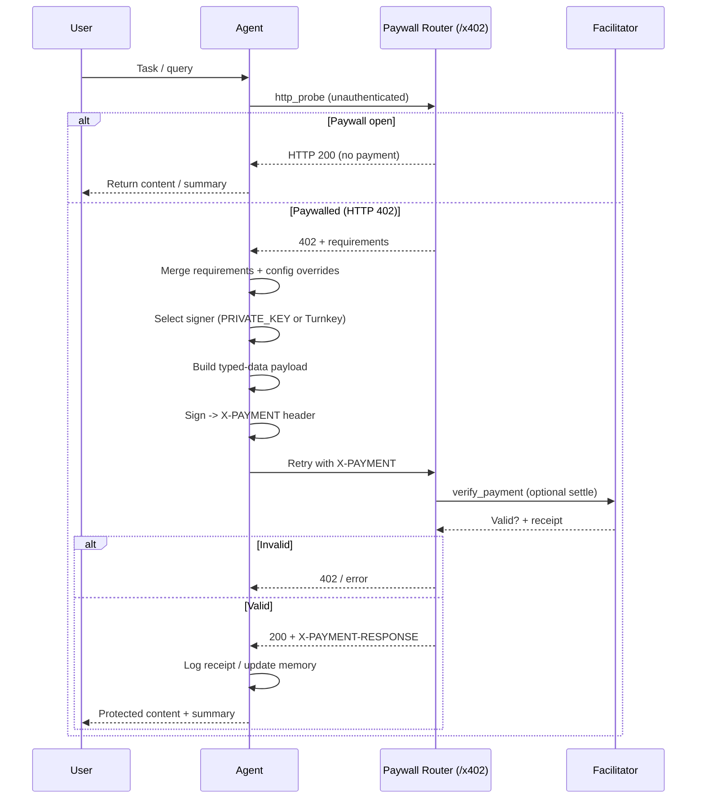

# x402 Payments

x402 is the payment rail for gating agent capabilities behind verifiable crypto authorizations. It uses signed typed-data and an HTTP 402 paywall pattern—agents can autonomously discover paywall requirements, sign payments, retry, and continue workflows.

**Key characteristics:**

- **Fast & verifiable** — TransferWithAuthorization-style payloads verified by facilitator before execution
- **Drop-in** — Prebuilt paywall router and tools (`x402_paywalled_request`, `x402_create_payment`)
- **Multi-signer** — Local keys preferred, with Turnkey fallback for hosted signing
- **Observable** — Standardized receipts (`X-PAYMENT-RESPONSE`) for logging and analytics

## Components

| Piece | Role inside SpoonOS |
| --- | --- |
| **x402 facilitator** | Public service (`https://x402.org/facilitator` by default) that verifies and settles signed payment payloads. |
| **Paywall server** | Your FastAPI router (`spoon_ai.payments.app`) that refuses unpaid requests with a 402 payload and forwards valid calls to agents. |
| **SpoonReact agent** | Issues HTTP probes, signs payments via tools, and stores payment receipts in memory. |
| **Signer** | Either the `PRIVATE_KEY` loaded in-process or a Turnkey identity configured via `TURNKEY_*` variables. |

## Configuration surfaces

Most deployments only need a `.env` entry and (optionally) config overrides:

```bash
X402_RECEIVER_ADDRESS=0xwallet-that-receives-fees
X402_FACILITATOR_URL=https://x402.org/facilitator
X402_DEFAULT_ASSET=
X402_DEFAULT_NETWORK=
X402_DEFAULT_SCHEME=exact
X402_DEFAULT_AMOUNT_USDC=
X402_PAYWALL_APP_NAME=SpoonOS Agent Services
X402_PAYWALL_APP_LOGO=https://your-domain.example/logo.png
X402_DEMO_URL=https://www.x402.org/protected
```

Key points:

- The system always prefers the local `PRIVATE_KEY`. If that variable is empty and Turnkey credentials (`TURNKEY_*`) exist, SpoonOS transparently switches to hosted signing.
- In CLI workflows (spoon-cli or the legacy `main.py` CLI), the `x402` block in the CLI `config.json` mirrors these defaults (branding, description, timeout, etc.). Update that file when you need per-environment variance. The core SDK still reads values from environment variables.
- Setting `X402_DEFAULT_ASSET` ensures all typed-data domains reference the real USDC contract so signatures pass facilitator validation.

## Runtime lifecycle



If the paid retry fails (for example `verify_payment` rejects the header or the facilitator reports an error), the paywall server immediately returns another `402` or error payload and the agent decides whether to run `x402_paywalled_request` again with corrected parameters. A successful verification moves straight into settlement and target agent execution, so there is no additional retry cycle once the `X-PAYMENT` header is accepted.

## Operational checklist

1. Use [https://faucet.circle.com/](https://faucet.circle.com/) to mint 0.01 USDC for the public demo.
2. Keep `X402_RECEIVER_ADDRESS` aligned with the wallet that ultimately receives settlements.
3. Monitor facilitator responses. Any `invalid_exact_evm_payload_signature` errors typically mean the `asset`, `chainId`, or nonce encoding no longer matches the paywall challenge.
4. Use `X402PaymentService.decode_payment_response(header)` to archive payment receipts in logs or analytics pipelines.
