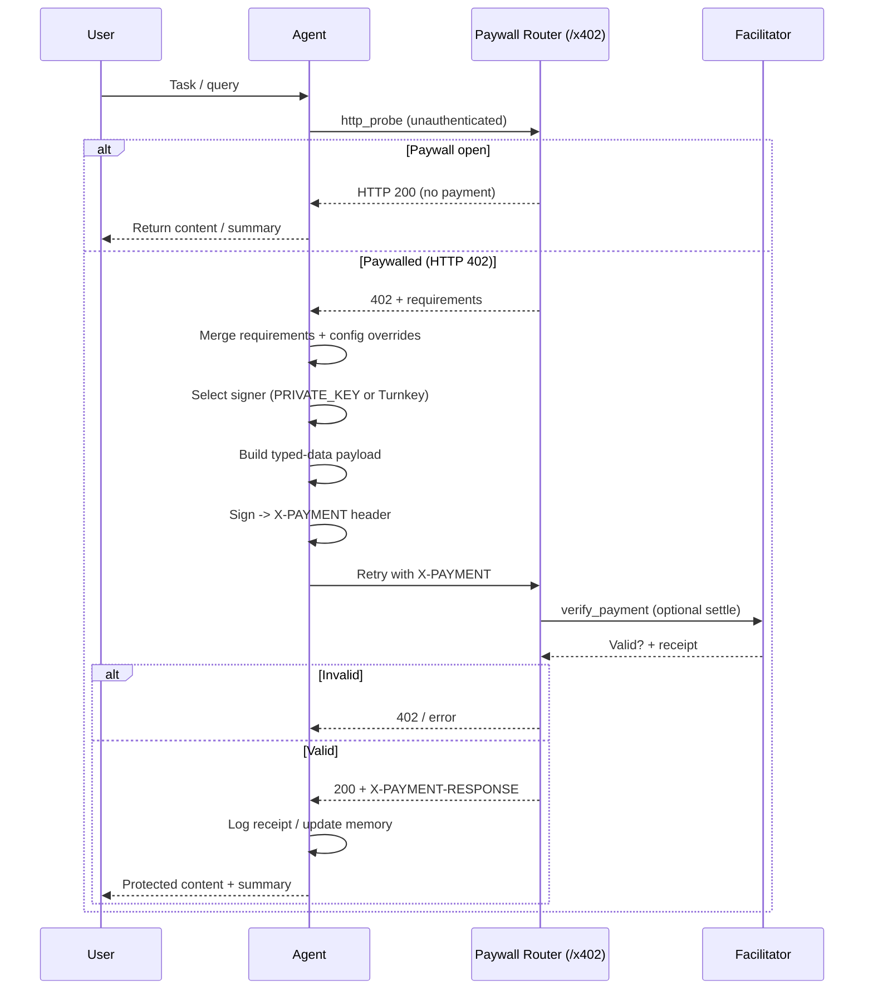

# x402 Payments

## Introduction

x402 is a payment protocol for gating AI agent capabilities behind verifiable cryptocurrency authorizations. It implements the HTTP 402 "Payment Required" status code with EIP-712 typed-data signatures, enabling agents to autonomously discover payment requirements, sign transactions, and continue workflows—creating a native monetization layer for agent-to-agent and human-to-agent interactions.

### Core Capabilities

- **Autonomous Payments**: Agents detect 402 responses, extract requirements, sign payments, and retry without human intervention
- **Cryptographic Verification**: EIP-712 typed-data signatures verified by a public facilitator before funds move
- **Instant Settlement**: TransferWithAuthorization-style payloads enable immediate verification and settlement
- **Flexible Signing**: Supports local private keys, hardware wallets, or hosted signing via Turnkey
- **Standardized Receipts**: `X-PAYMENT-RESPONSE` headers provide auditable payment proofs for logging and compliance

### Comparison with Other Agent Payment Systems

| Aspect | x402 | Stripe/Traditional | Lightning Network | Token Gating |
|--------|------|-------------------|-------------------|--------------|
| **Settlement** | Instant (crypto) | 1-3 days | Instant | N/A |
| **Agent Autonomy** | Native (auto-sign) | Requires webhooks | Manual channels | Read-only |
| **Verification** | On-chain + facilitator | Stripe API | Node verification | Contract call |
| **Micropayments** | Yes (low gas L2s) | High fees | Yes | Gas-dependent |
| **Integration** | HTTP 402 standard | Custom API | Protocol-specific | Contract calls |

**When to use x402:**

- You're building paid agent services (API access, premium tools, compute)
- You want agents to autonomously pay for resources they consume
- You need instant, verifiable settlements without traditional payment processor delays
- You're building in a Web3 context where users already have crypto wallets

---

## Quick Start

```bash
pip install spoon-ai
export PRIVATE_KEY="your-wallet-private-key"
```

```python
from spoon_ai.agents import SpoonReactAI
from spoon_ai.payments import x402_paywalled_request

# Agent auto-detects 402 and signs payments
agent = SpoonReactAI(tools=[x402_paywalled_request])
result = await agent.run("Fetch https://api.example.com/premium")
```

---

## Components

| Piece | Role inside SpoonOS |
| --- | --- |
| **x402 facilitator** | Public service (`https://x402.org/facilitator` by default) that verifies and settles signed payment payloads. |
| **Paywall server** | Your FastAPI router (`spoon_ai.payments.app`) that refuses unpaid requests with a 402 payload and forwards valid calls to agents. |
| **SpoonReact agent** | Issues HTTP probes, signs payments via tools, and stores payment receipts in memory. |
| **Signer** | Either the `PRIVATE_KEY` loaded in-process or a Turnkey identity configured via `TURNKEY_*` variables. |

## Configuration surfaces

Most deployments only need a `.env` entry and (optionally) config overrides:

```bash
X402_RECEIVER_ADDRESS=0xwallet-that-receives-fees
X402_FACILITATOR_URL=https://x402.org/facilitator
X402_DEFAULT_ASSET=
X402_DEFAULT_NETWORK=
X402_DEFAULT_SCHEME=exact
X402_DEFAULT_AMOUNT_USDC=
X402_PAYWALL_APP_NAME=SpoonOS Agent Services
X402_PAYWALL_APP_LOGO=https://your-domain.example/logo.png
X402_DEMO_URL=https://www.x402.org/protected
```

Key points:

- The system always prefers the local `PRIVATE_KEY`. If that variable is empty and Turnkey credentials (`TURNKEY_*`) exist, SpoonOS transparently switches to hosted signing.
- In CLI workflows (spoon-cli or the legacy `main.py` CLI), the `x402` block in the CLI `config.json` mirrors these defaults (branding, description, timeout, etc.). Update that file when you need per-environment variance. The core SDK still reads values from environment variables.
- Setting `X402_DEFAULT_ASSET` ensures all typed-data domains reference the real USDC contract so signatures pass facilitator validation.

## Runtime lifecycle



If the paid retry fails (for example `verify_payment` rejects the header or the facilitator reports an error), the paywall server immediately returns another `402` or error payload and the agent decides whether to run `x402_paywalled_request` again with corrected parameters. A successful verification moves straight into settlement and target agent execution, so there is no additional retry cycle once the `X-PAYMENT` header is accepted.

## Operational checklist

1. Use [https://faucet.circle.com/](https://faucet.circle.com/) to mint 0.01 USDC for the public demo.
2. Keep `X402_RECEIVER_ADDRESS` aligned with the wallet that ultimately receives settlements.
3. Monitor facilitator responses. Any `invalid_exact_evm_payload_signature` errors typically mean the `asset`, `chainId`, or nonce encoding no longer matches the paywall challenge.
4. Use `X402PaymentService.decode_payment_response(header)` to archive payment receipts in logs or analytics pipelines.
