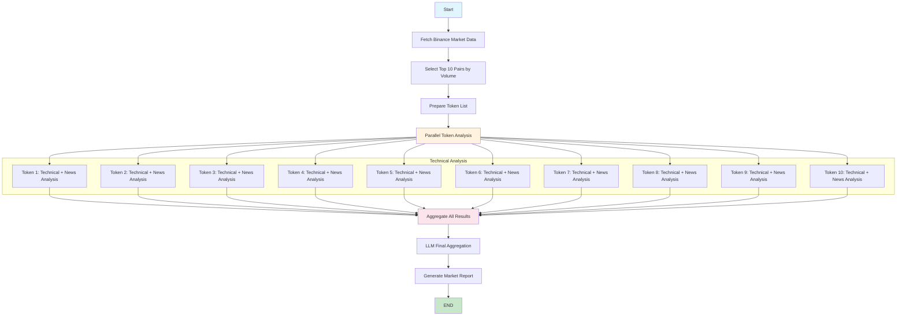

# Graph Crypto Analysis

This example implements a complete cryptocurrency research and analysis pipeline using the declarative graph building system, demonstrating end-to-end LLM-driven decision making for market analysis and investment recommendations.

#### 📊 **Workflow Diagram**



#### 🎯 **Core Features**

**Intelligent Market Analysis:**
- LLM-driven token selection based on real-time market conditions
- Multi-timeframe analysis (1h, 4h) for comprehensive market view
- Dynamic decision flow guided by LLM analysis at each step

**Advanced Technical Analysis:**
- Real-time indicator calculation (RSI, MACD, EMA) using PowerData toolkit
- Market sentiment analysis and momentum evaluation
- Risk assessment and volatility metrics for each token

**LLM-Powered Synthesis:**
- Intelligent summarization of complex market data
- Data-driven investment recommendations with reasoning
- Short-term and macro-level market outlook generation

#### 🚀 **Key Capabilities**

- **Declarative Graph Building** - `GraphTemplate`, `NodeSpec`, `EdgeSpec` for modular workflows
- **High-Level API Integration** - `HighLevelGraphAPI` for automatic parameter inference
- **Complete Workflow** - End-to-end from data ingestion to final recommendations
- **Real API Integration** - Live Binance and cryptocurrency data via PowerData toolkit
- **LLM Decision Making** - Every major decision guided by LLM analysis
- **Advanced State Management** - Complex analysis state throughout the process
- **Error Recovery** - Robust error handling and fallback mechanisms

#### 📋 **Prerequisites**

```bash
# Required environment variables
export OPENAI_API_KEY="your-openai-api-key"          # Primary LLM
export ANTHROPIC_API_KEY="your-anthropic-api-key"   # Alternative LLM
export TAVILY_API_KEY="your-tavily-api-key"       # Search engine
```

#### 🏃 **Quick Start**

```bash
# Navigate to examples directory
cd spoon-cookbook/example

# Install dependencies
pip install -r requirements.txt

# Run the declarative crypto analysis
python graph_crypto_analysis.py
```

#### 🔍 **What to Observe**

**Architecture:**
- How `GraphTemplate` and `NodeSpec` simplify workflow construction
- `HighLevelGraphAPI` automatically inferring parameters from queries
- Modular node implementations with better separation of concerns

**Data Flow:**
- Real market data fetching from Binance API and PowerData toolkit
- LLM analysis of raw data for intelligent decision making
- Step-by-step process from data collection to final recommendations

**Technical Analysis:**
- Real-time indicator calculation using PowerData toolkit
- Correlation of different data sources
- Market sentiment analysis and quantification

**LLM Decision Process:**
- Token evaluation and selection for analysis
- Synthesis combining technical and fundamental analysis
- Investment recommendations with detailed reasoning

#### 📊 **Sample Output**

```
🔍 MARKET ANALYSIS REPORT
━━━━━━━━━━━━━━━━━━━━━━━━━━━━━━━━━━━━━━━━━━━━━━━━━

📈 SELECTED TOKENS FOR ANALYSIS: BTC, ETH, SOL, ADA

📊 TECHNICAL ANALYSIS:
• BTC/USDT: Bullish momentum, RSI: 68, MACD positive crossover
• ETH/USDT: Consolidation phase, approaching key resistance
• SOL/USDT: Strong uptrend, breaking previous highs
• ADA/USDT: Recovery phase, positive volume momentum

🎯 INVESTMENT RECOMMENDATIONS:
• SHORT-TERM: Consider BTC and SOL for momentum plays
• MEDIUM-TERM: Hold ETH through current consolidation
• RISK ASSESSMENT: Moderate volatility expected in next 24-48 hours

💡 MARKET OUTLOOK:
The current market shows strong bullish momentum with BTC leading...
```

#### 📁 **Source Code**

- **Main Example**: [graph_crypto_analysis.py](https://github.com/XSpoonAi/spoon-core/blob/main/examples/graph_crypto_analysis.py)
- **Supporting Modules**:
  - `spoon_ai/graph/builder.py` - Declarative templates and high-level API
  - `spoon_ai/tools/crypto_tools.py` - PowerData integration helpers
  - `spoon_ai/graph/` - Core engine and monitoring utilities
  - [Tool System Docs](../core-concepts/tools.md)

#### 🎓 **Learning Outcomes**

- Using declarative graph building (`GraphTemplate`, `NodeSpec`, `EdgeSpec`)
- Leveraging `HighLevelGraphAPI` for automatic parameter inference
- Implementing modular, maintainable node functions
- Building complete end-to-end analysis systems with LLM integration
- Advanced cryptocurrency market analysis techniques
- Real-time data processing and technical indicator calculation
- LLM-driven decision making in complex workflows
- Error handling and data validation in financial applications

#### 💡 **Best Practices**

- Declarative architecture for improved modularity
- High-level API usage for automatic parameter inference
- Data validation and comprehensive error handling
- Performance optimization and efficient data processing
- Security considerations for API keys and financial data
- Modular architecture with clean separation of concerns
