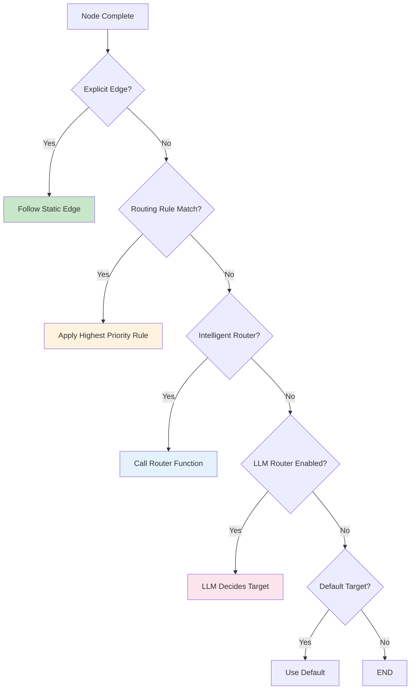

# Advanced Features

This guide covers production-ready patterns for building robust, scalable graph workflows.

**You will learn:** Routing layers, parallel execution, HITL, retries, and monitoring patterns
**Best for:** Users ready for production hardening and debugging
**Time to complete:** ~8–12 minutes

## Routing Strategies

The Graph System evaluates routing in a priority order, giving you multiple layers of control.

### Routing Priority Stack



### 1. Conditional Edges (Most Common)

Route based on state inspection:

```python
def route_by_confidence(state: AnalysisState) -> str:
    """Route based on analysis confidence level."""
    confidence = state.get("confidence", 0.0)

    if confidence >= 0.8:
        return "high_confidence"
    elif confidence >= 0.5:
        return "medium_confidence"
    return "low_confidence"

graph.add_conditional_edges(
    source="analyze",
    condition=route_by_confidence,
    path_map={
        "high_confidence": "generate_recommendation",
        "medium_confidence": "request_clarification",
        "low_confidence": "escalate_to_human",
    }
)
```

### 2. Routing Rules (Pattern-Based)

For pattern matching with priorities:

```python
# Priority 10 - Specific patterns first
graph.add_routing_rule(
    source_node="entry",
    condition=lambda state, query: "urgent" in query.lower(),
    target_node="priority_handler",
    priority=10
)

# Priority 5 - Category-based
graph.add_routing_rule(
    source_node="entry",
    condition=lambda state, query: state.get("category") == "trading",
    target_node="trading_handler",
    priority=5
)

# Priority 1 - Default fallback
graph.add_routing_rule(
    source_node="entry",
    condition=lambda state, query: True,  # Always matches
    target_node="general_handler",
    priority=1
)
```

### 3. Intelligent Router (Custom Logic)

For complex routing logic:

```python
async def intelligent_router(state: AnalysisState, available_nodes: List[str]) -> str:
    """
    Custom routing logic with access to all available nodes.
    """
    intent = state.get("intent", "")
    confidence = state.get("confidence", 0)
    history = state.get("routing_history", [])

    # Avoid loops
    if "analyze" in history and intent == "retry":
        return "human_review"

    # Route based on complex conditions
    if intent == "trading" and confidence > 0.9:
        return "execute_trade" if "execute_trade" in available_nodes else "review_trade"

    return "general_handler"

graph.set_intelligent_router(intelligent_router)
```

### 4. LLM-Powered Routing (Most Flexible)

Let an LLM decide the next step:

```python
from spoon_ai.graph.config import GraphConfig, RouterConfig

config = GraphConfig(
    router=RouterConfig(
        allow_llm=True,
        llm_timeout=8.0,
        default_target="fallback_handler",
        allowed_targets=["price_handler", "trade_handler", "analysis_handler"],
    )
)

graph = StateGraph(AnalysisState)
graph.config = config

# Or enable after creation
graph.enable_llm_routing(config={
    "model": "gpt-4",
    "temperature": 0.1,
    "max_tokens": 50,
})
```

### Routing Decision Matrix

| Routing Type | Complexity | Latency | Use Case |
|--------------|------------|---------|----------|
| Static Edge | None | ~0ms | Linear workflows |
| Conditional Edge | Low | ~0ms | State-based branching |
| Routing Rules | Medium | ~0ms | Pattern matching |
| Intelligent Router | Medium | ~1ms | Custom business logic |
| LLM Router | High | ~500ms | Natural language understanding |

---

## Parallel Execution

Execute multiple nodes concurrently for better performance.

### Basic Parallel Group

```python
from spoon_ai.graph.config import ParallelGroupConfig

graph.add_parallel_group(
    "market_data_fetch",
    nodes=["fetch_binance", "fetch_coinbase", "fetch_kraken"],
    config=ParallelGroupConfig(
        join_strategy="all",
        timeout=15.0,
    )
)
```

### Join Strategies

| Strategy | Behavior | Use Case |
|----------|----------|----------|
| `"all"` | Wait for all nodes to complete | Need complete data from all sources |
| `"any"` | Return when first node completes | Redundant sources, want fastest |
| `"quorum"` | Wait for majority (configurable) | Fault-tolerant consensus |

```python
# Quorum: Wait for 2 out of 3 (66%)
config = ParallelGroupConfig(
    join_strategy="quorum",
    quorum=0.66,  # 66% = 2 of 3 nodes
    timeout=15.0,
)

# Any: Return on first success
config = ParallelGroupConfig(
    join_strategy="any",
    timeout=10.0,
)
```

### Error Strategies

| Strategy | Behavior | Use Case |
|----------|----------|----------|
| `"fail_fast"` | Cancel all, raise exception | Critical path, must all succeed |
| `"collect_errors"` | Continue, store errors in `__errors__` | Best-effort, report issues |
| `"ignore_errors"` | Continue, discard failures | Non-critical enrichment |

```python
from spoon_ai.graph.config import ParallelGroupConfig, ParallelRetryPolicy

config = ParallelGroupConfig(
    join_strategy="quorum",
    quorum=0.66,
    timeout=30.0,

    # Error handling
    error_strategy="collect_errors",

    # Retry policy for individual nodes
    retry_policy=ParallelRetryPolicy(
        max_retries=2,
        backoff_initial=0.5,
        backoff_multiplier=2.0,
        backoff_max=5.0,
    ),

    # Resource controls
    max_in_flight=10,
    rate_limit_per_second=5.0,

    # Circuit breaker
    circuit_breaker_threshold=5,
    circuit_breaker_cooldown=30.0,
)
```

### Complete Parallel Example

```python
import asyncio
from typing import TypedDict, Dict, Any, List
from spoon_ai.graph import StateGraph, END
from spoon_ai.graph.config import ParallelGroupConfig

class MultiSourceState(TypedDict):
    symbol: str
    source_a_data: Dict[str, Any]
    source_b_data: Dict[str, Any]
    source_c_data: Dict[str, Any]
    aggregated_price: float
    errors: List[str]

async def fetch_source_a(state: MultiSourceState) -> dict:
    await asyncio.sleep(0.1)  # Simulate API call
    return {"source_a_data": {"price": 45000, "source": "A"}}

async def fetch_source_b(state: MultiSourceState) -> dict:
    await asyncio.sleep(0.2)
    return {"source_b_data": {"price": 45050, "source": "B"}}

async def fetch_source_c(state: MultiSourceState) -> dict:
    await asyncio.sleep(0.15)
    # Simulate occasional failure
    if state.get("symbol") == "FAIL":
        raise Exception("Source C unavailable")
    return {"source_c_data": {"price": 44980, "source": "C"}}

async def aggregate_prices(state: MultiSourceState) -> dict:
    prices = []
    for key in ["source_a_data", "source_b_data", "source_c_data"]:
        data = state.get(key, {})
        if data.get("price"):
            prices.append(data["price"])

    avg = sum(prices) / len(prices) if prices else 0
    return {"aggregated_price": avg}

# Build graph
graph = StateGraph(MultiSourceState)

graph.add_node("fetch_a", fetch_source_a)
graph.add_node("fetch_b", fetch_source_b)
graph.add_node("fetch_c", fetch_source_c)
graph.add_node("aggregate", aggregate_prices)

# Configure parallel group
graph.add_parallel_group(
    "data_fetch",
    nodes=["fetch_a", "fetch_b", "fetch_c"],
    config=ParallelGroupConfig(
        join_strategy="quorum",
        quorum=0.66,
        timeout=5.0,
        error_strategy="collect_errors",
    )
)

# Edges
graph.add_edge("fetch_a", "aggregate")
graph.add_edge("fetch_b", "aggregate")
graph.add_edge("fetch_c", "aggregate")
graph.add_edge("aggregate", END)

graph.set_entry_point("fetch_a")
app = graph.compile()
```

---

## Human-in-the-Loop

Interrupt execution to collect user input, then resume.

### Basic Interrupt Pattern

```python
from spoon_ai.graph import interrupt, Command

async def confirm_trade_node(state: TradeState) -> dict:
    """Node that requires user confirmation."""
    trade_details = state.get("trade_details", {})

    # Check if already confirmed
    if not state.get("user_confirmed"):
        # Interrupt execution and wait for user
        interrupt({
            "type": "confirmation_required",
            "question": f"Execute {trade_details['action']} {trade_details['amount']} {trade_details['symbol']}?",
            "trade_details": trade_details,
        })

    # This runs after resume with confirmation
    return {
        "trade_executed": True,
        "execution_time": "2024-01-15T10:30:00Z"
    }
```

### Handling Interrupts

```python
# Initial execution - will interrupt
result = await app.invoke(
    {"user_query": "Buy 0.1 BTC", "user_confirmed": False},
    config={"configurable": {"thread_id": "trade_session"}}
)

# Check for interrupt
if "__interrupt__" in result:
    interrupt_info = result["__interrupt__"][0]
    print(f"Question: {interrupt_info['value']['question']}")

    # Get user confirmation (from UI, CLI, API, etc.)
    user_confirmed = input("Confirm? (y/n): ").lower() == "y"

    # Resume execution with user response
    result = await app.invoke(
        Command(resume={"user_confirmed": user_confirmed}),
        config={"configurable": {"thread_id": "trade_session"}}
    )

print(f"Final result: {result}")
```

### Multi-Step Approval Workflow

```python
class ApprovalState(TypedDict):
    request: str
    manager_approved: bool
    compliance_approved: bool
    final_status: str

async def request_manager_approval(state: ApprovalState) -> dict:
    if not state.get("manager_approved"):
        interrupt({
            "type": "manager_approval",
            "request": state["request"],
            "approver_role": "manager"
        })
    return {}

async def request_compliance_approval(state: ApprovalState) -> dict:
    if not state.get("compliance_approved"):
        interrupt({
            "type": "compliance_approval",
            "request": state["request"],
            "approver_role": "compliance"
        })
    return {}

async def execute_request(state: ApprovalState) -> dict:
    if state["manager_approved"] and state["compliance_approved"]:
        return {"final_status": "approved_and_executed"}
    return {"final_status": "rejected"}

# Wire up: request → manager → compliance → execute
```

### Interrupt Best Practices

:::tip Guidelines
1. **Always check state first** - Don't interrupt if already confirmed
2. **Include context** - Provide all info needed for decision
3. **Use thread IDs** - Required for resume functionality
4. **Handle timeout** - What if user never responds?
5. **Log interrupts** - Track for audit purposes
:::

---

## Error Handling

Production-ready error handling patterns.

### Retry Policies

```python
from spoon_ai.graph.config import ParallelRetryPolicy

retry_policy = ParallelRetryPolicy(
    max_retries=3,              # Try up to 3 times
    backoff_initial=0.5,        # Start with 0.5s delay
    backoff_multiplier=2.0,     # Double each time: 0.5, 1, 2
    backoff_max=10.0,           # Cap at 10 seconds
)
```

### Circuit Breakers

Prevent cascading failures:

```python
config = ParallelGroupConfig(
    # After 5 failures, disable the group
    circuit_breaker_threshold=5,

    # Re-enable after 30 seconds
    circuit_breaker_cooldown=30.0,
)
```

### Error Handling in Nodes

```python
async def robust_api_node(state: MyState) -> dict:
    """Node with comprehensive error handling."""
    import logging
    logger = logging.getLogger(__name__)

    try:
        result = await external_api_call(state["symbol"])
        return {
            "data": result,
            "error": None,
            "status": "success"
        }

    except ConnectionError as e:
        logger.warning(f"Connection failed for {state['symbol']}: {e}")
        return {
            "data": None,
            "error": f"Connection error: {e}",
            "status": "retry_suggested"
        }

    except TimeoutError as e:
        logger.error(f"Timeout for {state['symbol']}: {e}")
        return {
            "data": None,
            "error": f"Timeout: {e}",
            "status": "timeout"
        }

    except Exception as e:
        logger.exception(f"Unexpected error for {state['symbol']}")
        return {
            "data": None,
            "error": f"Unexpected: {e}",
            "status": "failed"
        }
```

### State Validation

```python
from spoon_ai.graph.config import GraphConfig

def validate_state(state: dict) -> None:
    """Raise exception if state is invalid."""
    if not state.get("user_id"):
        raise ValueError("user_id is required")

    if state.get("amount", 0) < 0:
        raise ValueError("amount cannot be negative")

config = GraphConfig(
    state_validators=[validate_state],
    max_iterations=100,
)

graph = StateGraph(MyState)
graph.config = config
```

---

## Resource Controls

Manage system resources and prevent overload.

### Rate Limiting

```python
config = ParallelGroupConfig(
    rate_limit_per_second=10.0,  # Max 10 requests/second
    max_in_flight=5,            # Max 5 concurrent tasks
)
```

### Execution Limits

```python
from spoon_ai.graph.config import GraphConfig

config = GraphConfig(
    max_iterations=100,  # Prevent infinite loops
)
```

### Timeout Configuration

```python
config = ParallelGroupConfig(
    timeout=30.0,  # 30 second timeout for parallel group
)

# Or for LLM routing
router_config = RouterConfig(
    llm_timeout=8.0,  # 8 second timeout for LLM calls
)
```

---

## Configuration Reference

### GraphConfig

```python
from spoon_ai.graph.config import GraphConfig, RouterConfig

config = GraphConfig(
    # Execution limits
    max_iterations=100,

    # Router configuration
    router=RouterConfig(
        allow_llm=False,
        allowed_targets=None,        # None = all nodes allowed
        default_target=None,         # Fallback when no route matches
        llm_timeout=8.0,
        enable_fallback_to_default=True,
    ),

    # Validation
    state_validators=[],

    # Pre-configured parallel groups
    parallel_groups={},
)
```

### ParallelGroupConfig

```python
from spoon_ai.graph.config import ParallelGroupConfig, ParallelRetryPolicy

config = ParallelGroupConfig(
    # Join behavior
    join_strategy="all",        # "all", "any", "quorum"
    quorum=None,                # For quorum: 0.0-1.0 or int

    # Timing
    timeout=None,               # None = unlimited

    # Error handling
    error_strategy="fail_fast", # "fail_fast", "collect_errors", "ignore_errors"

    # Retry
    retry_policy=ParallelRetryPolicy(
        max_retries=0,
        backoff_initial=0.5,
        backoff_multiplier=2.0,
        backoff_max=10.0,
    ),

    # Resource controls
    max_in_flight=None,
    rate_limit_per_second=None,

    # Circuit breaker
    circuit_breaker_threshold=None,
    circuit_breaker_cooldown=30.0,
)
```

---

## Next Steps

Learn how to integrate your graphs with the broader SpoonOS ecosystem:

**[Integration & Extensions →](./integration.md)** - GraphAgent, tools, MCP protocol, memory management
