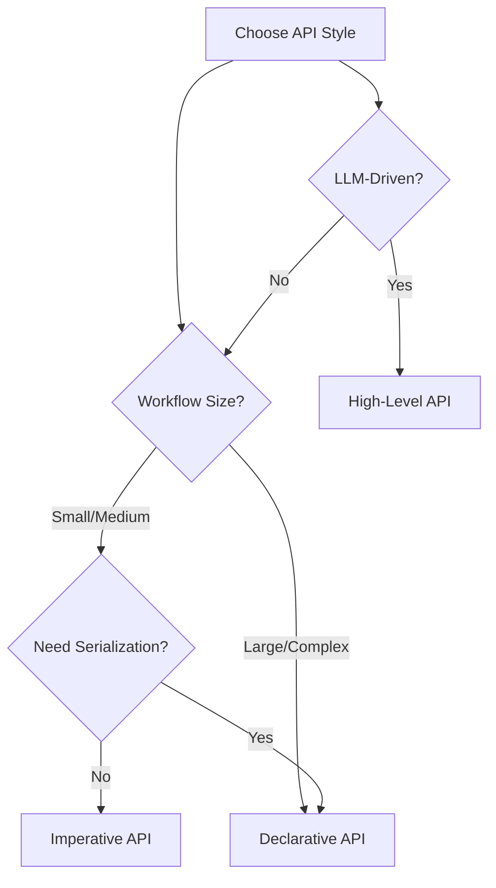

# Building Graphs

SpoonOS provides three ways to build graphs, each suited for different scenarios. Choose based on your workflow complexity and team needs.

**You will learn:** Imperative, declarative, and high-level APIs with when-to-use guidance
**Best for:** Users who understand core concepts and want to pick an API style
**Time to complete:** ~6–10 minutes

## API Comparison

| Feature | Imperative | Declarative | High-Level |
|---------|------------|-------------|------------|
| **Complexity** | Simple | Medium | Advanced |
| **Use Case** | Quick prototypes, simple workflows | Large workflows, team collaboration | LLM-driven, dynamic routing |
| **Serializable** | No | Yes | Yes |
| **Code Style** | Method chaining | Template objects | Automatic inference |
| **Best For** | Learning, small graphs | Production systems | Intelligent agents |

---

## Imperative API

The simplest way to build graphs. Use method calls to add nodes and edges directly.

### When to Use

- ✅ Quick prototypes and experiments
- ✅ Simple linear or branching workflows
- ✅ Learning the Graph System
- ❌ Large, complex workflows (hard to maintain)
- ❌ Team collaboration (no serialization)

### Basic Example

```python
import asyncio
from typing import TypedDict
from spoon_ai.graph import StateGraph, END

class WorkflowState(TypedDict):
    input: str
    step1_result: str
    step2_result: str
    final_result: str

async def step1(state: WorkflowState) -> dict:
    return {"step1_result": f"Step1 processed: {state['input']}"}

async def step2(state: WorkflowState) -> dict:
    return {"step2_result": f"Step2 processed: {state['step1_result']}"}

async def finalize(state: WorkflowState) -> dict:
    return {"final_result": f"Final: {state['step2_result']}"}

# Build graph imperatively
graph = StateGraph(WorkflowState)

# Add nodes
graph.add_node("step1", step1)
graph.add_node("step2", step2)
graph.add_node("finalize", finalize)

# Add edges (linear flow)
graph.add_edge("step1", "step2")
graph.add_edge("step2", "finalize")
graph.add_edge("finalize", END)

# Set entry point
graph.set_entry_point("step1")

# Compile and run
app = graph.compile()

async def main():
    result = await app.invoke({
        "input": "Hello",
        "step1_result": "",
        "step2_result": "",
        "final_result": ""
    })
    print(result["final_result"])
    # Output: Final: Step2 processed: Step1 processed: Hello

if __name__ == "__main__":
    asyncio.run(main())
```

### With Conditional Routing

```python
from spoon_ai.graph import StateGraph, END
from typing import TypedDict

class RouterState(TypedDict):
    query: str
    category: str
    result: str

async def classify(state: RouterState) -> dict:
    query = state["query"].lower()
    if "price" in query:
        return {"category": "price"}
    elif "news" in query:
        return {"category": "news"}
    return {"category": "general"}

async def handle_price(state: RouterState) -> dict:
    return {"result": f"Price handler: {state['query']}"}

async def handle_news(state: RouterState) -> dict:
    return {"result": f"News handler: {state['query']}"}

async def handle_general(state: RouterState) -> dict:
    return {"result": f"General handler: {state['query']}"}

def route_by_category(state: RouterState) -> str:
    return state.get("category", "general")

# Build graph
graph = StateGraph(RouterState)

graph.add_node("classify", classify)
graph.add_node("price", handle_price)
graph.add_node("news", handle_news)
graph.add_node("general", handle_general)

graph.set_entry_point("classify")

# Conditional routing
graph.add_conditional_edges(
    "classify",
    route_by_category,
    {
        "price": "price",
        "news": "news",
        "general": "general"
    }
)

# All handlers go to END
graph.add_edge("price", END)
graph.add_edge("news", END)
graph.add_edge("general", END)

app = graph.compile()
```

### API Reference

| Method | Description | Example |
|--------|-------------|---------|
| `add_node(name, fn)` | Add a node | `graph.add_node("process", my_fn)` |
| `add_edge(from, to)` | Add static edge | `graph.add_edge("a", "b")` |
| `add_conditional_edges(source, condition, path_map)` | Add conditional routing | See above |
| `set_entry_point(name)` | Set starting node | `graph.set_entry_point("start")` |
| `compile()` | Create executable | `app = graph.compile()` |

---

## Declarative API

Define graphs using template objects. Better for large workflows and team collaboration.

### When to Use

- ✅ Large, complex workflows
- ✅ Team collaboration (serializable templates)
- ✅ Version-controlled graph definitions
- ✅ Parallel execution groups
- ❌ Quick prototypes (more boilerplate)

### Template Components

```python
from spoon_ai.graph.builder import (
    DeclarativeGraphBuilder,
    GraphTemplate,
    NodeSpec,
    EdgeSpec,
    ParallelGroupSpec,
)
from spoon_ai.graph.config import GraphConfig, ParallelGroupConfig
```

| Component | Purpose |
|-----------|---------|
| `NodeSpec` | Define a node with name, function, and optional group |
| `EdgeSpec` | Define an edge between nodes |
| `ParallelGroupSpec` | Group nodes for concurrent execution |
| `GraphTemplate` | Container for all specifications |
| `DeclarativeGraphBuilder` | Builds StateGraph from template |

### Basic Declarative Example

```python
import asyncio
from typing import TypedDict, Dict, Any
from spoon_ai.graph import END
from spoon_ai.graph.builder import (
    DeclarativeGraphBuilder,
    GraphTemplate,
    NodeSpec,
    EdgeSpec,
)
from spoon_ai.graph.config import GraphConfig

class AnalysisState(TypedDict):
    query: str
    analysis: str
    summary: str

async def analyze(state: AnalysisState) -> dict:
    return {"analysis": f"Analysis of: {state['query']}"}

async def summarize(state: AnalysisState) -> dict:
    return {"summary": f"Summary: {state['analysis']}"}

# Define nodes
nodes = [
    NodeSpec("analyze", analyze),
    NodeSpec("summarize", summarize),
]

# Define edges
edges = [
    EdgeSpec("analyze", "summarize"),
    EdgeSpec("summarize", END),
]

# Create template
template = GraphTemplate(
    entry_point="analyze",
    nodes=nodes,
    edges=edges,
    config=GraphConfig(max_iterations=50),
)

# Build graph
builder = DeclarativeGraphBuilder(AnalysisState)
graph = builder.build(template)
app = graph.compile()

async def main():
    result = await app.invoke({
        "query": "Bitcoin trend",
        "analysis": "",
        "summary": ""
    })
    print(result["summary"])

if __name__ == "__main__":
    asyncio.run(main())
```

### With Parallel Groups

```python
from spoon_ai.graph.builder import (
    DeclarativeGraphBuilder,
    GraphTemplate,
    NodeSpec,
    EdgeSpec,
    ParallelGroupSpec,
)
from spoon_ai.graph.config import GraphConfig, ParallelGroupConfig

class DataState(TypedDict):
    symbol: str
    binance_data: Dict[str, Any]
    coinbase_data: Dict[str, Any]
    kraken_data: Dict[str, Any]
    aggregated: Dict[str, Any]

async def fetch_binance(state: DataState) -> dict:
    # Simulated API call
    return {"binance_data": {"source": "binance", "price": 45000}}

async def fetch_coinbase(state: DataState) -> dict:
    return {"coinbase_data": {"source": "coinbase", "price": 45050}}

async def fetch_kraken(state: DataState) -> dict:
    return {"kraken_data": {"source": "kraken", "price": 44980}}

async def aggregate(state: DataState) -> dict:
    prices = [
        state.get("binance_data", {}).get("price", 0),
        state.get("coinbase_data", {}).get("price", 0),
        state.get("kraken_data", {}).get("price", 0),
    ]
    avg_price = sum(prices) / len([p for p in prices if p > 0])
    return {"aggregated": {"average_price": avg_price}}

# Define nodes with parallel group assignment
nodes = [
    NodeSpec("fetch_binance", fetch_binance, parallel_group="data_fetch"),
    NodeSpec("fetch_coinbase", fetch_coinbase, parallel_group="data_fetch"),
    NodeSpec("fetch_kraken", fetch_kraken, parallel_group="data_fetch"),
    NodeSpec("aggregate", aggregate),
]

# Define edges
edges = [
    EdgeSpec("fetch_binance", "aggregate"),
    EdgeSpec("fetch_coinbase", "aggregate"),
    EdgeSpec("fetch_kraken", "aggregate"),
    EdgeSpec("aggregate", END),
]

# Define parallel group
parallel_groups = [
    ParallelGroupSpec(
        name="data_fetch",
        nodes=["fetch_binance", "fetch_coinbase", "fetch_kraken"],
        config=ParallelGroupConfig(
            join_strategy="all",      # Wait for all
            timeout=30.0,             # 30 second timeout
            error_strategy="collect_errors",
        )
    )
]

# Create template
template = GraphTemplate(
    entry_point="fetch_binance",  # Entry to parallel group
    nodes=nodes,
    edges=edges,
    parallel_groups=parallel_groups,
    config=GraphConfig(max_iterations=50),
)

# Build and compile
builder = DeclarativeGraphBuilder(DataState)
graph = builder.build(template)
app = graph.compile()
```

### Template Serialization

One key advantage of declarative templates is serialization:

```python
import json

# Serialize template (for storage/versioning)
template_dict = {
    "entry_point": template.entry_point,
    "nodes": [{"name": n.name, "parallel_group": n.parallel_group} for n in template.nodes],
    "edges": [{"source": e.source, "target": e.target} for e in template.edges],
}

# Save to file
with open("workflow_template.json", "w") as f:
    json.dump(template_dict, f, indent=2)
```

---

## High-Level API

The most advanced approach. Uses LLM to automatically infer parameters and make routing decisions.

### When to Use

- ✅ Complex, dynamic workflows
- ✅ LLM-driven decision making
- ✅ Natural language parameter extraction
- ✅ Intelligent agents with adaptive routing
- ❌ Simple, deterministic workflows (overkill)

### Key Components

```python
from spoon_ai.graph.builder import (
    HighLevelGraphAPI,
    Intent,
    MCPToolSpec,
    NodePlugin,
)
```

| Component | Purpose |
|-----------|---------|
| `HighLevelGraphAPI` | Main interface for intelligent graphs |
| `Intent` | Define possible user intents |
| `MCPToolSpec` | Integrate MCP tools |
| `NodePlugin` | Custom node behavior extensions |

### Example with Intent Classification

```python
from spoon_ai.graph.builder import (
    HighLevelGraphAPI,
    Intent,
    GraphTemplate,
    NodeSpec,
    EdgeSpec,
)

# Define possible intents
intents = [
    Intent(
        name="price_query",
        description="User wants to know the price of a cryptocurrency",
        required_params=["symbol"],
        example_queries=["What is BTC price?", "How much is ETH?"]
    ),
    Intent(
        name="market_analysis",
        description="User wants market analysis or trends",
        required_params=["symbol", "timeframe"],
        example_queries=["Analyze BTC trend", "What's the ETH outlook?"]
    ),
    Intent(
        name="general_question",
        description="General questions about crypto",
        required_params=[],
        example_queries=["What is blockchain?", "How do I stake?"]
    ),
]

# Create high-level API
api = HighLevelGraphAPI(
    state_schema=AnalysisState,
    intents=intents,
    llm_provider="openai",  # or "anthropic", "deepseek"
)

# Build nodes for each intent
async def handle_price_query(state):
    symbol = state.get("symbol", "BTC")
    return {"result": f"Price for {symbol}: $45,000"}

async def handle_market_analysis(state):
    symbol = state.get("symbol", "BTC")
    timeframe = state.get("timeframe", "24h")
    return {"result": f"Analysis for {symbol} ({timeframe}): Bullish"}

async def handle_general(state):
    return {"result": "General crypto information..."}

# Register handlers
api.register_intent_handler("price_query", handle_price_query)
api.register_intent_handler("market_analysis", handle_market_analysis)
api.register_intent_handler("general_question", handle_general)

# Build and compile
graph = api.build()
app = graph.compile()

# Usage: API automatically classifies intent and extracts params
async def main():
    result = await app.invoke({
        "user_query": "What is the current Bitcoin price?",
        # Other fields auto-populated by LLM
    })
    print(result["result"])
```

### Automatic Parameter Inference

The High-Level API can extract parameters from natural language:

```python
# User query: "Analyze ETH trend for the past week"
# API automatically extracts:
# - intent: "market_analysis"
# - symbol: "ETH"
# - timeframe: "1w"
```

### Integration with MCP Tools

```python
from spoon_ai.graph.builder import MCPToolSpec

# Define MCP tools for the graph
mcp_tools = [
    MCPToolSpec(
        name="tavily-search",
        description="Web search for crypto news",
        server_type="stdio",
        command="npx -y tavily-mcp"
    ),
    MCPToolSpec(
        name="crypto-data",
        description="Real-time crypto market data",
        server_type="http",
        endpoint="http://localhost:8080"
    ),
]

# Create API with MCP tools
api = HighLevelGraphAPI(
    state_schema=AnalysisState,
    intents=intents,
    mcp_tools=mcp_tools,
)
```

---

## Best Practices

### 1. Start Simple, Scale Up

```python
# Start with imperative for prototyping
graph = StateGraph(MyState)
graph.add_node("process", process_fn)
graph.set_entry_point("process")

# Move to declarative when workflow stabilizes
template = GraphTemplate(
    entry_point="process",
    nodes=[NodeSpec("process", process_fn)],
    edges=[EdgeSpec("process", END)],
)
```

### 2. Use Meaningful Node Names

```python
# Good: Descriptive names
graph.add_node("classify_user_intent", classify_fn)
graph.add_node("fetch_market_data", fetch_fn)
graph.add_node("generate_recommendation", recommend_fn)

# Bad: Generic names
graph.add_node("step1", classify_fn)
graph.add_node("step2", fetch_fn)
graph.add_node("step3", recommend_fn)
```

### 3. Group Related Functionality

```python
# Group data fetching nodes
parallel_groups = [
    ParallelGroupSpec(
        name="market_data",
        nodes=["fetch_price", "fetch_volume", "fetch_sentiment"],
        config=ParallelGroupConfig(join_strategy="all")
    )
]
```

### 4. Handle All Routing Cases

```python
# Always have a fallback
graph.add_conditional_edges(
    "classifier",
    route_function,
    {
        "known_intent_1": "handler_1",
        "known_intent_2": "handler_2",
        "unknown": "fallback_handler"  # Don't forget this!
    }
)
```

### 5. Document Your Templates

```python
template = GraphTemplate(
    entry_point="start",
    nodes=nodes,
    edges=edges,
    config=GraphConfig(
        max_iterations=100,
        # Document the purpose
        # This graph handles user queries about crypto prices
        # and market analysis with LLM-powered routing
    ),
)
```

---

## Comparison Summary



| Scenario | Recommended API |
|----------|-----------------|
| Learning/prototyping | Imperative |
| Production workflow | Declarative |
| Team collaboration | Declarative |
| Intelligent agent | High-Level |
| Simple automation | Imperative |
| Dynamic routing | High-Level |

## Next Steps

Ready for advanced patterns? Learn about:

**[Advanced Features →](./advanced-features.md)** - Routing strategies, parallel execution, human-in-the-loop, and error handling
