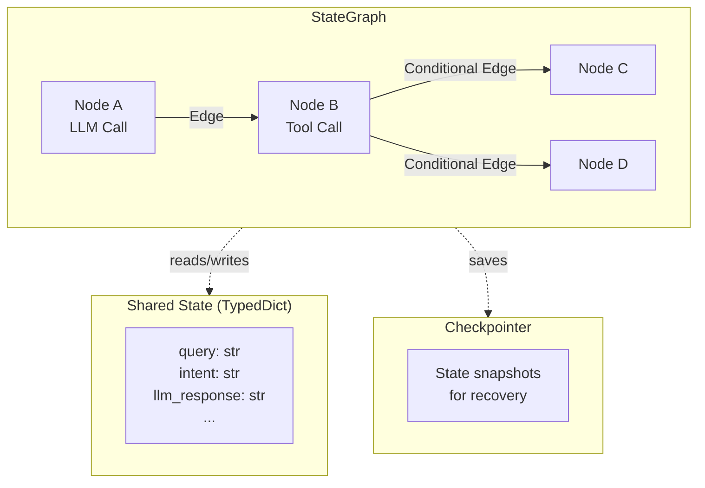
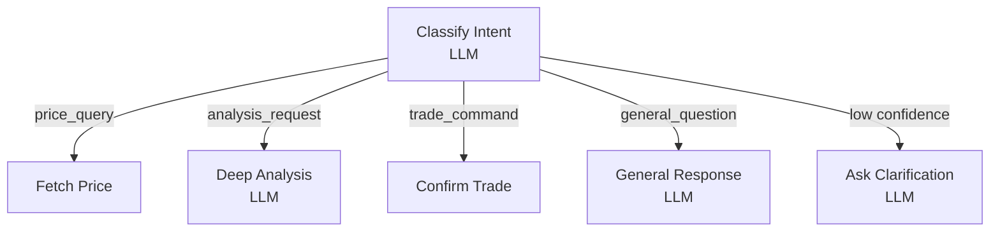

# Core Concepts

This guide covers the fundamental building blocks of the SpoonOS Graph System. Master these concepts and you'll be able to build any LLM-powered workflow.

**You will learn:** State, nodes, edges, checkpointing, and merge behavior
**Best for:** Beginners who finished Quick Start
**Time to complete:** ~5–8 minutes

## Overview



| Concept | Description | Key Point |
|---------|-------------|-----------|
| **State** | Typed dictionary shared across all nodes | Each node reads state, returns updates |
| **Node** | Async function (often calling LLM) | Single responsibility, returns partial update |
| **Edge** | Connection between nodes | Static, conditional, or LLM-driven |
| **Checkpoint** | State snapshot before each node | Enables recovery and human-in-the-loop |

---

## State

**State** is a `TypedDict` that flows through your entire graph. Every node receives the current state and can return updates to merge back.

### Defining State for LLM Workflows

```python
from typing import TypedDict, List, Dict, Any, Optional

class ConversationState(TypedDict):
    # Input fields
    user_query: str
    user_id: str

    # LLM-related fields
    messages: List[dict]           # Chat history for context
    intent: str                    # Classified intent
    extracted_params: Dict[str, Any]  # Parameters extracted by LLM

    # Processing fields
    llm_analysis: str              # LLM's analysis output
    tool_results: Dict[str, Any]   # Results from tool calls

    # Output fields
    final_response: str            # Final response to user
    confidence: float              # LLM's confidence score

    # System fields
    execution_log: List[str]
```

### State Merge Behavior

When a node returns an update, SpoonOS **merges** it into the existing state:

| Field Type | Merge Strategy | Example |
|------------|----------------|---------|
| **Scalar** (str, int, float, bool) | Replace | `"old" → "new"` |
| **dict** | Deep merge | `{a: 1} + {b: 2} → {a: 1, b: 2}` |
| **list** | Append (capped at 100) | `[1, 2] + [3] → [1, 2, 3]` |
| **None** | No change | Field keeps previous value |

```python
from spoon_ai.schema import Message

# Example: LLM node returns partial update
async def analyze_with_llm(state: ConversationState) -> dict:
    response = await llm.chat([
        Message(role="system", content="Analyze user intent and extract parameters."),
        Message(role="user", content=state["user_query"])
    ])

    # Only return fields that changed
    return {
        "intent": "price_query",
        "extracted_params": {"symbol": "BTC"},
        "confidence": 0.92
    }
    # Other fields remain unchanged
```

### State Best Practices

:::tip Guidelines
1. **Use TypedDict** - Get IDE autocomplete and type checking
2. **Include messages field** - For multi-turn LLM conversations
3. **Track confidence** - LLM outputs should include confidence scores
4. **Keep it JSON-serializable** - Required for checkpointing
5. **Initialize all fields** - Provide defaults at invoke time
:::

---

## Nodes

**Nodes** are async functions that perform work—typically calling an LLM, executing tools, or processing data.

### Node Contract

```python
from spoon_ai.schema import Message

async def my_llm_node(state: MyState) -> dict:
    """
    Node function signature:

    Args:
        state: Current graph state (read-only view)

    Returns:
        dict: Fields to update (merged into state)
    """
    # Read from state
    query = state.get("user_query", "")
    messages = state.get("messages", [])  # List of dicts for serialization

    # Convert history to Message objects and call LLM
    history = [Message(role=m["role"], content=m["content"]) for m in messages]
    response = await llm.chat(history + [
        Message(role="user", content=query)
    ])

    # Return updates (partial, not full state)
    # Store messages as dicts for JSON serialization
    return {
        "llm_response": response.content,
        "messages": messages + [
            {"role": "user", "content": query},
            {"role": "assistant", "content": response.content}
        ]
    }
```

### Node Patterns for LLM

#### Pattern 1: Intent Classification

```python
async def classify_intent_node(state: ConversationState) -> dict:
    """Use LLM to classify user intent."""
    response = await llm.chat([
        Message(role="system", content="""Classify the query into one of:
        - price_query: asking about cryptocurrency prices
        - analysis_request: requesting market analysis
        - trade_command: wanting to execute a trade
        - general_question: other questions

        Respond with JSON: {"intent": "category", "confidence": 0.0-1.0}"""),
        Message(role="user", content=state["user_query"])
    ])

    import json
    result = json.loads(response.content)
    return {
        "intent": result["intent"],
        "confidence": result["confidence"]
    }
```

#### Pattern 2: Parameter Extraction

```python
async def extract_params_node(state: ConversationState) -> dict:
    """Use LLM to extract parameters from natural language."""
    response = await llm.chat([
        Message(role="system", content="""Extract trading parameters from the query.
        Return JSON with: symbol, action (buy/sell), amount, price_type (market/limit)
        Example: {"symbol": "BTC", "action": "buy", "amount": 0.1, "price_type": "market"}"""),
        Message(role="user", content=state["user_query"])
    ])

    import json
    params = json.loads(response.content)
    return {"extracted_params": params}
```

#### Pattern 3: Analysis with Context

```python
async def analyze_with_context_node(state: ConversationState) -> dict:
    """LLM analysis using accumulated context."""
    # Build context from previous results
    context = f"""
    User Query: {state['user_query']}
    Intent: {state['intent']}
    Market Data: {state.get('tool_results', {}).get('market_data', 'N/A')}
    Historical Context: {state.get('messages', [])[-3:]}
    """

    response = await llm.chat([
        Message(role="system", content="You are an expert crypto analyst. Provide detailed analysis."),
        Message(role="user", content=context)
    ])

    return {"llm_analysis": response.content}
```

#### Pattern 4: Response Generation

```python
async def generate_response_node(state: ConversationState) -> dict:
    """Generate final user-facing response."""
    response = await llm.chat([
        Message(role="system", content="""Generate a helpful, concise response.
        Be clear and actionable. Include relevant data points."""),
        Message(role="user", content=f"""
        Original Query: {state['user_query']}
        Analysis: {state['llm_analysis']}
        Data: {state.get('tool_results', {})}

        Generate the final response:""")
    ])

    return {
        "final_response": response.content,
        "messages": state.get("messages", []) + [
            {"role": "assistant", "content": response.content}
        ]
    }
```

---

## Edges

**Edges** define how control flows between nodes. The Graph System supports multiple edge types.

### 1. Static Edges

Always transition from source to target:

```python
from spoon_ai.graph import StateGraph, END

graph = StateGraph(ConversationState)

# Add LLM-powered nodes
graph.add_node("classify", classify_intent_node)
graph.add_node("analyze", analyze_with_context_node)
graph.add_node("respond", generate_response_node)

# Static edges: classify → analyze → respond → END
graph.add_edge("classify", "analyze")
graph.add_edge("analyze", "respond")
graph.add_edge("respond", END)

graph.set_entry_point("classify")
```

### 2. Conditional Edges (LLM-Driven Routing)

Route based on LLM classification:

```python
def route_by_intent(state: ConversationState) -> str:
    """Route based on LLM-classified intent."""
    intent = state.get("intent", "general")
    confidence = state.get("confidence", 0)

    # Low confidence → ask for clarification
    if confidence < 0.7:
        return "clarify"

    return intent

graph.add_conditional_edges(
    source="classify",
    condition=route_by_intent,
    path_map={
        "price_query": "fetch_price",
        "analysis_request": "deep_analysis",
        "trade_command": "confirm_trade",
        "general_question": "general_response",
        "clarify": "ask_clarification"
    }
)
```



### 3. LLM-Powered Routing (Dynamic)

Let the LLM itself decide the next step:

```python
async def llm_router_node(state: ConversationState) -> dict:
    """LLM decides the next node to execute."""
    available_actions = ["search_web", "query_database", "generate_response", "ask_human"]

    response = await llm.chat([
        Message(role="system", content=f"""Based on the current state, decide the next action.
        Available actions: {available_actions}

        Consider:
        - User query: {state['user_query']}
        - Current data: {state.get('tool_results', {})}
        - Confidence: {state.get('confidence', 0)}

        Respond with just the action name."""),
        Message(role="user", content="What's the next step?")
    ])

    return {"next_action": response.content.strip()}

def route_by_llm_decision(state: ConversationState) -> str:
    return state.get("next_action", "generate_response")

graph.add_conditional_edges(
    source="decide_next",
    condition=route_by_llm_decision,
    path_map={
        "search_web": "web_search",
        "query_database": "db_query",
        "generate_response": "respond",
        "ask_human": "human_input"
    }
)
```

### Complete LLM Routing Example

```python
import asyncio
from typing import TypedDict
from spoon_ai.graph import StateGraph, END
from spoon_ai.llm import LLMManager
from spoon_ai.schema import Message

class RouterState(TypedDict):
    query: str
    intent: str
    confidence: float
    result: str

llm = LLMManager()

async def classify_intent(state: RouterState) -> dict:
    """LLM classifies intent with confidence."""
    response = await llm.chat([
        Message(role="system", content="""Classify and respond with JSON:
        {"intent": "price|news|analysis|general", "confidence": 0.0-1.0}"""),
        Message(role="user", content=state["query"])
    ])

    import json
    result = json.loads(response.content)
    return {"intent": result["intent"], "confidence": result["confidence"]}

async def handle_price(state: RouterState) -> dict:
    response = await llm.chat([
        Message(role="system", content="Provide cryptocurrency price information."),
        Message(role="user", content=state["query"])
    ])
    return {"result": response.content}

async def handle_news(state: RouterState) -> dict:
    response = await llm.chat([
        Message(role="system", content="Summarize relevant crypto news."),
        Message(role="user", content=state["query"])
    ])
    return {"result": response.content}

async def handle_analysis(state: RouterState) -> dict:
    response = await llm.chat([
        Message(role="system", content="Provide detailed market analysis."),
        Message(role="user", content=state["query"])
    ])
    return {"result": response.content}

async def handle_general(state: RouterState) -> dict:
    response = await llm.chat([
        Message(role="system", content="You are a helpful crypto assistant."),
        Message(role="user", content=state["query"])
    ])
    return {"result": response.content}

def route_by_intent(state: RouterState) -> str:
    return state.get("intent", "general")

# Build graph
graph = StateGraph(RouterState)

graph.add_node("classify", classify_intent)
graph.add_node("price_handler", handle_price)
graph.add_node("news_handler", handle_news)
graph.add_node("analysis_handler", handle_analysis)
graph.add_node("general_handler", handle_general)

graph.set_entry_point("classify")

graph.add_conditional_edges(
    "classify",
    route_by_intent,
    {
        "price": "price_handler",
        "news": "news_handler",
        "analysis": "analysis_handler",
        "general": "general_handler"
    }
)

graph.add_edge("price_handler", END)
graph.add_edge("news_handler", END)
graph.add_edge("analysis_handler", END)
graph.add_edge("general_handler", END)

app = graph.compile()
```

---

## Checkpointing

**Checkpointing** automatically saves state snapshots before each node execution. This enables:

- **Recovery**: Resume from last successful node after failure
- **Multi-turn conversations**: Maintain LLM context across sessions
- **Human-in-the-loop**: Pause for user input, resume with new data

### Configuring Checkpointing

```python
from spoon_ai.graph import StateGraph, InMemoryCheckpointer

checkpointer = InMemoryCheckpointer(
    max_checkpoints_per_thread=100
)

graph = StateGraph(
    ConversationState,
    checkpointer=checkpointer
)
```

### Multi-Turn LLM Conversations

```python
# First turn
result = await app.invoke(
    {"user_query": "What is Bitcoin?", "messages": []},
    config={"configurable": {"thread_id": "user_123_session"}}
)

# Second turn - LLM has context from first turn
result = await app.invoke(
    {"user_query": "What about its price trend?", "messages": result["messages"]},
    config={"configurable": {"thread_id": "user_123_session"}}
)

# The LLM knows "its" refers to Bitcoin from the conversation history
```

### Recovery from Failure

```python
try:
    result = await app.invoke(
        initial_state,
        config={"configurable": {"thread_id": "analysis_session"}}
    )
except Exception as e:
    print(f"Failed: {e}")

    # Get last successful state
    last_state = graph.get_state(
        {"configurable": {"thread_id": "analysis_session"}}
    )

    if last_state:
        print(f"Last node: {last_state.metadata.get('node')}")
        print(f"LLM responses so far: {last_state.values.get('llm_analysis')}")
```

---

## Key Takeaways

1. **State carries LLM context** - Messages, extracted params, analysis results flow through
2. **Nodes encapsulate LLM calls** - Each node does one LLM task well
3. **Edges route based on LLM output** - Intent classification drives workflow
4. **Checkpoints enable conversations** - Multi-turn context preserved across calls

## Next Steps

Learn how to construct graphs using different API styles:

**[Building Graphs →](./building-graphs.md)** - Imperative, Declarative, and High-Level APIs
