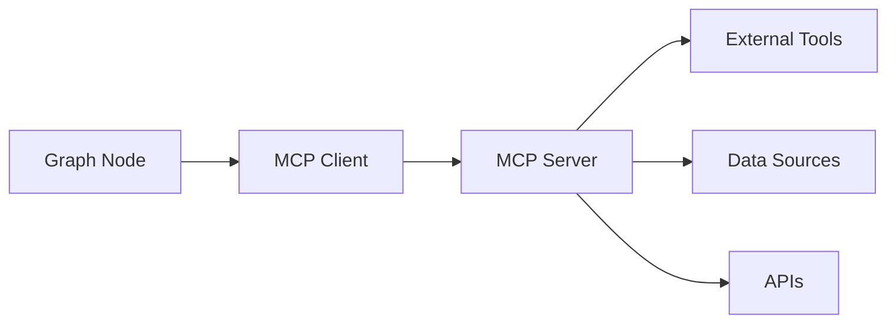

# Integration & Extensions

The Graph System integrates seamlessly with the broader SpoonOS ecosystem. This guide covers how to connect graphs with agents, tools, MCP servers, and memory systems.

## GraphAgent Integration

`GraphAgent` wraps graph execution with SpoonOS agent lifecycle, persistent memory, and session management.

### Basic GraphAgent Usage

```python
from spoon_ai.graph import StateGraph, GraphAgent

# Build your graph
graph = build_analysis_graph()  # Returns compiled StateGraph

# Create agent with memory
agent = GraphAgent(
    name="crypto_analyzer",
    graph=graph,
    memory_path="./agent_memory",
    session_id="user_123_session",
    preserve_state=True,  # Preserve state between runs
)

# Execute
result = await agent.run("Analyze BTC price trends")
print(result)
```

### Agent Configuration

```python
agent = GraphAgent(
    # Identity
    name="trading_assistant",
    description="AI assistant for cryptocurrency trading",

    # Graph
    graph=compiled_graph,

    # Memory
    memory_path="./memory",           # Directory for memory storage
    session_id="session_abc123",      # Unique session identifier

    # Behavior
    preserve_state=True,              # Keep state between runs
    max_history=100,                  # Max messages in history

    # LLM
    llm_provider="openai",            # Default LLM provider
    model="gpt-4",                    # Default model
)
```

### Execution Metadata

```python
# Run the agent
result = await agent.run("What's the BTC outlook?")

# Access execution metadata
metadata = agent.get_execution_metadata()

print(f"Successful: {metadata.get('execution_successful')}")
print(f"Duration: {metadata.get('execution_time_ms')}ms")
print(f"Nodes executed: {metadata.get('nodes_executed')}")
print(f"Final node: {metadata.get('final_node')}")
```

### Session Management

```python
# Current session
print(f"Current session: {agent.session_id}")

# Switch sessions
agent.load_session("user_456_session")

# Create new session
agent.new_session("user_789_session")

# List all sessions
sessions = agent.list_sessions()
print(f"Available sessions: {sessions}")
```

---

## Tool Integration

Use SpoonOS tools within graph nodes for external capabilities.

### Using Built-in Tools

```python
from spoon_toolkits.crypto.crypto_powerdata.tools import CryptoPowerDataCEXTool

async def fetch_market_data(state: MarketState) -> dict:
    """Node that uses the CryptoPowerData tool."""
    symbol = state.get("symbol", "BTC")

    # Initialize tool
    tool = CryptoPowerDataCEXTool()

    # Execute tool
    result = await tool.run(
        exchange="binance",
        symbol=f"{symbol}/USDT",
        timeframe="1h",
        limit=24
    )

    return {
        "market_data": result,
        "data_source": "binance"
    }
```

### Tool Result Handling

```python
async def process_with_tool(state: ProcessState) -> dict:
    """Robust tool usage with error handling."""
    from spoon_ai.tools import ToolManager

    tool_manager = ToolManager()

    try:
        # Get tool by name
        search_tool = tool_manager.get_tool("tavily-search")

        # Execute
        result = await search_tool.run(
            query=state.get("search_query"),
            max_results=5
        )

        return {
            "search_results": result.get("results", []),
            "tool_status": "success"
        }

    except Exception as e:
        return {
            "search_results": [],
            "tool_status": "error",
            "tool_error": str(e)
        }
```

### Multiple Tools in One Node

```python
async def comprehensive_analysis(state: AnalysisState) -> dict:
    """Node that orchestrates multiple tools."""
    symbol = state.get("symbol", "BTC")
    results = {}

    # Tool 1: Price data
    price_tool = CryptoPowerDataCEXTool()
    price_data = await price_tool.run(
        exchange="binance",
        symbol=f"{symbol}/USDT",
        timeframe="1h",
        limit=24
    )
    results["price_data"] = price_data

    # Tool 2: News search
    from spoon_ai.tools import TavilySearchTool
    news_tool = TavilySearchTool()
    news = await news_tool.run(
        query=f"{symbol} cryptocurrency news",
        max_results=5
    )
    results["news"] = news

    # Tool 3: Security check
    from spoon_toolkits.crypto.gopluslabs.tools import TokenSecurityTool
    security_tool = TokenSecurityTool()
    security = await security_tool.run(
        chain_id="1",
        token_address=state.get("token_address", "")
    )
    results["security"] = security

    return results
```

---

## MCP Protocol Integration

Connect to MCP (Model Context Protocol) servers for dynamic tool discovery.

### MCP Overview



### Using MCP Tools in Graphs

```python
from spoon_ai.graph.mcp_integration import MCPToolNode
from spoon_ai.graph import StateGraph

# Define MCP server connection
mcp_config = {
    "server_type": "stdio",
    "command": "npx",
    "args": ["-y", "tavily-mcp"],
    "env": {"TAVILY_API_KEY": "your-key"}
}

# Create MCP-enabled node
async def mcp_search_node(state: SearchState) -> dict:
    """Node that uses MCP tools."""
    from spoon_ai.agents.mcp_client_mixin import MCPClientMixin

    # Initialize MCP client
    mcp = MCPClientMixin()
    await mcp.connect_to_server(mcp_config)

    # Get available tools
    tools = await mcp.list_tools()
    print(f"Available MCP tools: {[t.name for t in tools]}")

    # Call a tool
    result = await mcp.call_tool(
        "search",
        {"query": state.get("query")}
    )

    await mcp.disconnect()

    return {"search_results": result}
```

### High-Level MCP Integration

```python
from spoon_ai.graph.builder import HighLevelGraphAPI, MCPToolSpec

# Define MCP tools
mcp_tools = [
    MCPToolSpec(
        name="web-search",
        description="Search the web",
        server_type="stdio",
        command="npx -y tavily-mcp"
    ),
    MCPToolSpec(
        name="file-system",
        description="File operations",
        server_type="stdio",
        command="npx -y @anthropic/mcp-server-filesystem"
    ),
]

# Create graph with MCP tools
api = HighLevelGraphAPI(
    state_schema=MyState,
    intents=intents,
    mcp_tools=mcp_tools,
)

graph = api.build()
```

### For More MCP Information

See the dedicated **[MCP Protocol Guide](/docs/core-concepts/mcp-protocol)** for:
- Server types (stdio, HTTP, WebSocket)
- Authentication and security
- Custom MCP server development
- Advanced tool discovery patterns

---

## Memory Management

Persist state and conversation history across sessions.

### GraphAgent Memory Operations

```python
# Create agent with memory
agent = GraphAgent(
    name="assistant",
    graph=graph,
    memory_path="./memory",
    session_id="user_123"
)

# Set metadata
agent.set_memory_metadata("last_analysis_time", "2024-01-15T10:30:00Z")
agent.set_memory_metadata("user_preferences", {
    "risk_tolerance": "medium",
    "favorite_tokens": ["BTC", "ETH", "SOL"]
})

# Get metadata
last_time = agent.get_memory_metadata("last_analysis_time")
prefs = agent.get_memory_metadata("user_preferences")

# Get statistics
stats = agent.get_memory_statistics()
print(f"Total messages: {stats['total_messages']}")
print(f"Total tokens: {stats['total_tokens']}")
print(f"Session count: {stats['session_count']}")
```

### Memory Search

```python
# Search conversation history
matches = agent.search_memory(
    query="bitcoin analysis",
    limit=5
)

for match in matches:
    print(f"Score: {match['score']}")
    print(f"Content: {match['content'][:100]}...")
    print(f"Timestamp: {match['timestamp']}")
    print("---")
```

### State Persistence

```python
# Enable state persistence
agent = GraphAgent(
    name="persistent_agent",
    graph=graph,
    preserve_state=True,  # Key setting
    memory_path="./memory"
)

# First run
result1 = await agent.run("Remember my favorite token is SOL")

# Later run (state is preserved)
result2 = await agent.run("What's my favorite token?")
# Agent can access information from previous runs
```

### Memory with Checkpointing

```python
from spoon_ai.graph import InMemoryCheckpointer

# Combine graph checkpointing with agent memory
checkpointer = InMemoryCheckpointer(max_checkpoints_per_thread=50)

graph = StateGraph(MyState, checkpointer=checkpointer)
# ... build graph ...

agent = GraphAgent(
    name="full_memory_agent",
    graph=graph.compile(),
    memory_path="./memory",
    preserve_state=True
)

# Now you have:
# 1. Graph-level checkpoints (for recovery within a run)
# 2. Agent-level memory (for persistence across runs)
```

---

## Monitoring and Debugging

Track execution and diagnose issues.

### Enable Monitoring

```python
# Enable specific metrics
graph.enable_monitoring([
    "execution_time",
    "success_rate",
    "routing_performance",
    "node_stats",
])

app = graph.compile()
```

### Execution Metrics

```python
# Run the graph
result = await app.invoke(initial_state)

# Get metrics
metrics = app.get_execution_metrics()

print(f"""
Execution Summary:
  Total executions: {metrics['total_executions']}
  Success rate: {metrics['success_rate']:.1%}
  Avg execution time: {metrics['avg_execution_time']:.3f}s
  Max execution time: {metrics['max_execution_time']:.3f}s
""")

# Per-node statistics
print("Per-Node Statistics:")
for node, stats in metrics.get('node_stats', {}).items():
    print(f"  {node}:")
    print(f"    Calls: {stats['count']}")
    print(f"    Avg time: {stats['avg_time']:.3f}s")
    print(f"    Error rate: {stats['error_rate']:.1%}")
```

### Execution History

```python
# Get detailed step-by-step history
history = app.get_execution_history()

for step in history:
    print(f"""
Step: {step['node']}
  Iteration: {step['iteration']}
  Success: {step['success']}
  Execution time: {step['execution_time']:.3f}s
  Timestamp: {step['timestamp']}
  State keys modified: {step.get('modified_keys', [])}
""")
```

### Debugging with Checkpoints

```python
# Enable verbose logging
import logging
logging.getLogger("spoon_ai.graph").setLevel(logging.DEBUG)

# Run with checkpointing
result = await app.invoke(
    initial_state,
    config={"configurable": {"thread_id": "debug_session"}}
)

# Inspect checkpoint history
config = {"configurable": {"thread_id": "debug_session"}}
for checkpoint in graph.get_state_history(config):
    print(f"After node: {checkpoint.metadata.get('node')}")
    print(f"State: {checkpoint.values}")
    print("---")
```

### Streaming for Real-Time Monitoring

```python
# Stream execution for real-time updates
async for update in app.stream(initial_state):
    node = update.get("__node__", "unknown")
    print(f"[{node}] State update: {list(update.keys())}")

    # Check for specific conditions
    if update.get("error"):
        print(f"  ERROR: {update['error']}")

    if update.get("confidence", 0) < 0.5:
        print(f"  LOW CONFIDENCE: {update.get('confidence')}")
```

---

## Integration Patterns

### Pattern 1: Full-Stack Agent

```python
from spoon_ai.graph import StateGraph, GraphAgent, InMemoryCheckpointer
from spoon_ai.tools import ToolManager

# 1. Build graph with tools
async def tool_node(state):
    tool_manager = ToolManager()
    result = await tool_manager.execute("crypto-price", {"symbol": state["symbol"]})
    return {"price_data": result}

graph = StateGraph(MyState, checkpointer=InMemoryCheckpointer())
graph.add_node("fetch_data", tool_node)
# ... more nodes ...
app = graph.compile()

# 2. Wrap with GraphAgent
agent = GraphAgent(
    name="full_stack_agent",
    graph=app,
    memory_path="./memory",
    preserve_state=True
)

# 3. Enable monitoring
graph.enable_monitoring(["execution_time", "node_stats"])

# 4. Use the agent
result = await agent.run("Analyze BTC")
```

### Pattern 2: Multi-Agent Handoff

```python
# Agent 1: Research
research_agent = GraphAgent(
    name="researcher",
    graph=research_graph,
    session_id="shared_session"
)

# Agent 2: Analysis
analysis_agent = GraphAgent(
    name="analyst",
    graph=analysis_graph,
    session_id="shared_session"  # Same session = shared memory
)

# Agent 3: Execution
execution_agent = GraphAgent(
    name="executor",
    graph=execution_graph,
    session_id="shared_session"
)

# Handoff pattern
research_result = await research_agent.run("Research BTC market")
analysis_result = await analysis_agent.run("Analyze the research findings")
execution_result = await execution_agent.run("Execute based on analysis")
```

### Pattern 3: Event-Driven Graph

```python
async def event_handler(event_type: str, data: dict):
    """Handle events from external systems."""
    agent = GraphAgent(
        name="event_processor",
        graph=event_graph,
        session_id=f"event_{event_type}"
    )

    result = await agent.run(
        f"Process {event_type} event",
        initial_state={"event_data": data}
    )

    return result

# Register handlers
@on_event("price_alert")
async def handle_price_alert(data):
    return await event_handler("price_alert", data)

@on_event("trade_signal")
async def handle_trade_signal(data):
    return await event_handler("trade_signal", data)
```

---

## Next Steps

See practical implementations of these integration patterns:

**[Examples →](./examples.md)** - Complete working examples with routing, parallel execution, and human-in-the-loop patterns
